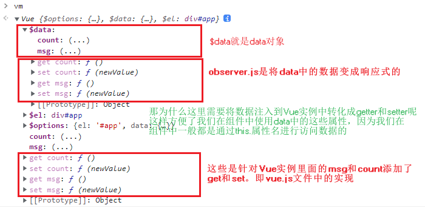
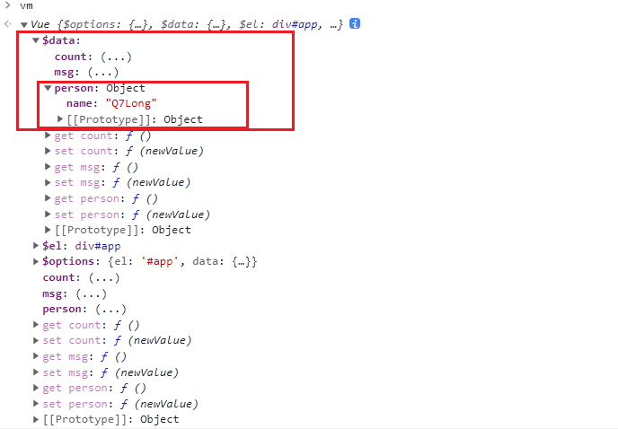
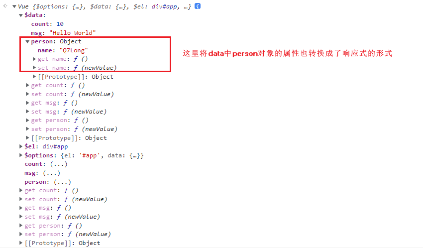
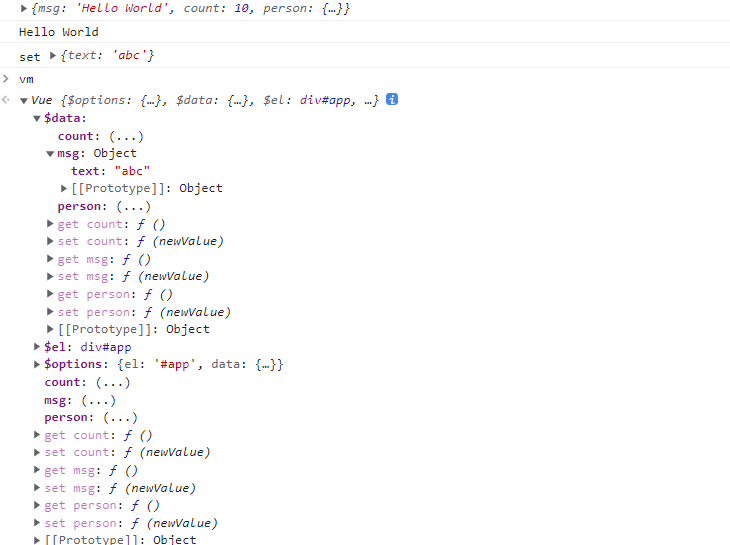
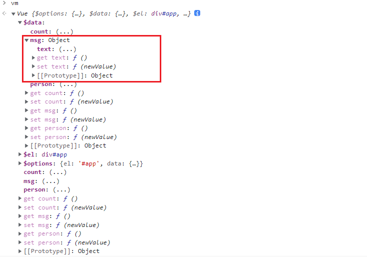
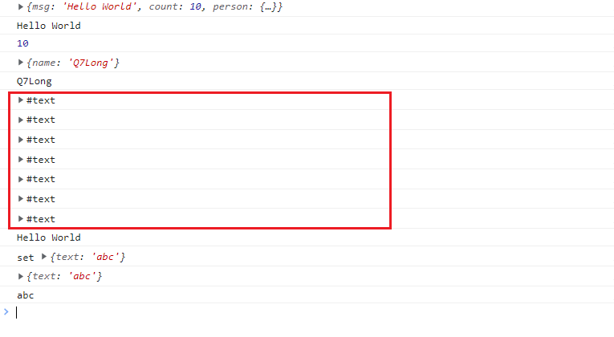
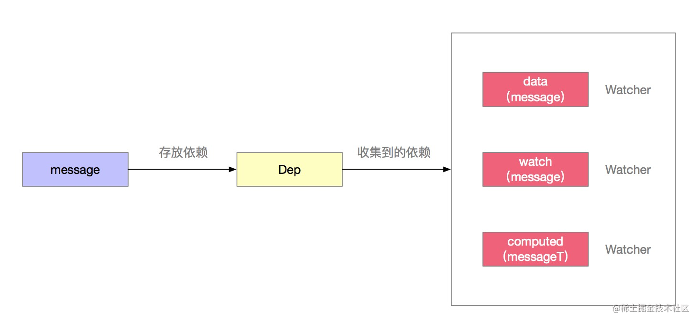

# Vue响应式原理 Made by Q7Long

### 1、目标

模拟一个最小版本的`Vue`

实际项目中出现问题的原理层面的解决

​    给`Vue`实例新增一个成员是否是响应式的？

​    给属性重新赋值成对象，是否是响应式的？
### 2、数据驱动
在实现整个`Vue`响应式代码之前，先来了解几个概念。

第一个：数据驱动

第二个：响应式的核心原理

第三个：发布订阅模式和观察这模式

我们先来看一下数据驱动的内容：

数据响应式，双向绑定，数据驱动（我们经常看到这几个词）

<font color="#ff502c" style="background:#fff5f5">数据响应式</font> ：数据模型仅仅是普通的 <font color="#ff502c" style="background:#fff5f5">JavaScript</font> 对象，而当我们修改数据时，视图会进行更新，避免了频繁的 <font color="#ff502c" style="background:#fff5f5">DOM</font> 操作，提高开发效率，这与 <font color="#ff502c" style="background:#fff5f5">Jquery</font> 不一样， <font color="#ff502c" style="background:#fff5f5">Jquery</font> 是频繁的操作 <font color="#ff502c" style="background:#fff5f5">DOM</font> 

<font color="#ff502c" style="background:#fff5f5">双向绑定: </font> 

   数据改变，视图改变，视图改变，数据也随之改变( 通过这句话，我们可以看到在双向绑定中是包含了数据响应式的内容)

​    我们可以使用 <font color="#ff502c" style="background:#fff5f5">v-model</font> 在表单元素上创建双向数据绑定

<font color="#ff502c" style="background:#fff5f5">数据驱动</font> 是<font color="#ff502c" style="background:#fff5f5">Vue</font> 最独特的特性之一

​     开发过程中仅仅需要关注数据本身，不需要关心数据是如何渲染到视图中的。主流的 <font color="#ff502c" style="background:#fff5f5">MVVM</font> 框架都已经实现了数据响应式与双向绑定，所以可以将数据绑定到 <font color="#ff502c" style="background:#fff5f5">DOM</font> 上。


## 3、响应式的核心原理

### 3.1 `Vue2.x`响应式原理

关于`Vue2.x`的响应式原理在官方文档中也有介绍。

`https://cn.vuejs.org/v2/guide/reactivity.html`

在该文档中，我们注意如下一段内容：

```
当你把一个普通的 JavaScript 对象传入 Vue 实例作为 data 选项，Vue 将遍历此对象所有的 property，并使用 Object.defineProperty 把这些 property 全部转为 getter/setter。Object.defineProperty 是 ES5 中一个无法 shim 的特性，这也就是 Vue 不支持 IE8 以及更低版本浏览器的原因。
```

通过以上的文字，我们可以看到，在 <font color="#ff502c" style="background:#fff5f5">`Vue2.x`</font> 中响应式的实现是通过 <font color="#ff502c" style="background:#fff5f5">Object.defineProperty</font> 来完成的，注意该属性无法降级(shim)处理，所以`Vue`不支持`IE8`以及更低版本的浏览器的原因。

下面我们来看一下 <font color="#ff502c" style="background:#fff5f5">Object.defineProperty</font> 基本使用

修改 <font color="#ff502c" style="background:#fff5f5">data</font> 对象中的 <font color="#ff502c" style="background:#fff5f5">msg</font> 属性的值，实现视图的更新.(这也就是我们所说的响应式)

*defineProperty.html*

```html
<!DOCTYPE html>
<html lang="en">
  <head>
    <meta charset="UTF-8" />
    <meta name="viewport" content="width=device-width, initial-scale=1.0" />
    <title>defineProperty</title>
  </head>
  <body>
    <div id="app">hello</div>
    <script>
      //模拟Vue中的data选项(当)
      let data = {
        msg: "hello",
      };
      //模拟Vue的实例
      let vm = {};
      //数据劫持，只要是对vm对象中的msg属性进行操作的时候都会执行下面的代码，当访问或者设置vm中的成员的时候，做一些干预操作
      Object.defineProperty(vm, "msg", {
        //可枚举(可遍历)
        enumerable: true,
        //可配置（可以使用delete删除,可以通过defineProperty重新定义)
        configurable: true,
        //当获取值的时候执行
        get() {
          console.log("get:", data.msg);
          return data.msg;
        },
        // 当设置值的时候执行
        set(newValue) {
          console.log("set:", newValue);
          //设置的值与原有的值相同，则没有更改，所以不做任何操作
          if (newValue === data.msg) {
            return;
          }
          data.msg = newValue;
          //数据更改，更新DOM的值
          document.querySelector("#app").textContent = data.msg;
        },
      });
      //测试
      //执行set操作
      vm.msg = "abc";
      //执行get操作
      console.log(vm.msg);
    </script>
  </body>
</html>
```
在进行测试的时候，可以在浏览器的控制台中，输入 <font color="#ff502c" style="background:#fff5f5">vm.msg</font> 进行测试。
在上面的代码中，我们是将一个对象中的属性转换成了 <font color="#ff502c" style="background:#fff5f5">getter/setter</font> 的形式，那么这里我们还有一个问题:
如果有一个对象中多个属性需要转换 <font color="#ff502c" style="background:#fff5f5">getter/setter</font> ，那么应该如何处理？
我们可以通过循环遍历的方式，将对象中的多个属性转换成 <font color="#ff502c" style="background:#fff5f5">getter/setter</font> 
我们应该怎么处理呢？我们可以通过循环遍历的方式实现。重点循环遍历对象中的key： <font color="#ff502c" style="background:#fff5f5"> Object.keys(data).forEach((key) => {})</font> 

*defineProperty2.html*
```html
<!DOCTYPE html>
<html lang="en">
  <head>
    <meta charset="UTF-8" />
    <meta name="viewport" content="width=device-width, initial-scale=1.0" />
    <title>defineProperty多个属性</title>
  </head>
  <body>
    <div id="app">hello</div>
    <script>
      // 模拟Vue中的data选项
      let data = {
        msg: "hello",
        count: 10,
      };
      // 模拟Vue实例
      let vm = {};
      proxyData(data);
      function proxyData(data) {
        // 遍历data对象中的所有属性
        Object.keys(data).forEach((key) => {
          // 把data中的属性，转换成vm的setter/getter
          Object.defineProperty(vm, key, {
            enumerable: true,
            configurable: true,
            get() {
              console.log("get", key, data[key]);
              return data[key];
            },
            set(newValue) {
              console.log("set:", key, newValue);
              if (newValue === data[key]) {
                return;
              }
              data[key] = newValue;
              document.querySelector("#app").textContent = data[key];
            },
          });
        });
      }
      vm.msg = "hello world";
      console.log(vm.msg);
    </script>
  </body>
</html>
```
在上面的代码中，我们通过循环的方式给 <font color="#ff502c" style="background:#fff5f5">data</font> 对象中的每个属性添加了 <font color="#ff502c" style="background:#fff5f5">getter/setter</font> 

这里我们只是在视图中展示了 <font color="#ff502c" style="background:#fff5f5">msg</font> 属性的值，如果想展示 <font color="#ff502c" style="background:#fff5f5">count</font> 属性的值，可以在浏览器的控制台中，通过 <font color="#ff502c" style="background:#fff5f5">vm.count = 20</font> 这种形式来展示，当然，在后期的课程中我们会分别展示出 <font color="#ff502c" style="background:#fff5f5">msg</font> 与 <font color="#ff502c" style="background:#fff5f5">count</font> 属性的值。


### 3.2 `Vue3`响应式原理

<font color="#ff502c" style="background:#fff5f5">Vue3</font> 的响应式原理是通过 <font color="#ff502c" style="background:#fff5f5">Proxy</font> 来完成的。

<font color="#ff502c" style="background:#fff5f5">Proxy</font> 直接监听对象，而非属性，所以将多个属性转换成 <font color="#ff502c" style="background:#fff5f5">getter/setter</font> 的时候，不需要使用循环。

<font color="#ff502c" style="background:#fff5f5">Proxy</font> 是 <font color="#ff502c" style="background:#fff5f5">ES6</font> 课程中新增的， <font color="#ff502c" style="background:#fff5f5">IE6</font> 不支持

<font color="#ff502c" style="background:#fff5f5">Proxy</font> 实现响应式的基本代码如下：

*3. Proxy.html*
```html
/* Proxy.html */
<!DOCTYPE html>
<html lang="en">
  <head>
    <meta charset="UTF-8" />
    <meta name="viewport" content="width=device-width, initial-scale=1.0" />
    <title>Proxy</title>
  </head>
  <body>
    <div id="app">hello</div>
    <script>
      //模拟Vue中的data选项
      let data = {
        msg: "hello",
        count: 0,
      };
      //模拟Vue实例
      //为data创建一个代理对象vm,这样就可以通过vm.msg来获取data中的msg属性的值，而这时候会执行get方法
      let vm = new Proxy(data, {
        // 当访问vm的成员时会执行
        //target表示代理的对象（这里为data对象），key表示所代理的对象中的属性  target就相当于是data(代理对象)，那么target[key] 就是获取 key 所对应的值
        get(target, key) {
          console.log("get key:", key, target[key]);
          return target[key];
        },
        //当设置vm的成员时会执行
        set(target, key, newValue) {
          console.log("set key:", key, newValue);
          if (target[key] === newValue) {
            return;
          }
          target[key] = newValue;
          document.querySelector("#app").textContent = target[key];
        },
      });
      //测试
      vm.msg = "aaaa";
      console.log(vm.msg);
    </script>
  </body>
</html>
```
通过以上的代码我们发现使用 <font color="#ff502c" style="background:#fff5f5">Proxy</font> 的代码是给对象中所有属性添加 <font color="#ff502c" style="background:#fff5f5">getter/setter</font> ,而不需要通过循环的方式来实现，所以代码更加的简洁。

#### 发布订阅模式

发布订阅模式：订阅者，发布者，信号中心

```
我们假定，存在一个“信号中心”，某个任务执行完成，就向信号中心"发布"(publish)一个信号，其它任务可以向信号中心“订阅”(subscribe)这个信号，从而知道什么时候自己可以开始执行。这就叫做"发布/订阅模式"(publish-subscribe pattern)
```

家长向学生所在的班级订阅了获取学生考试成绩的事件，当老师公布学生的成绩后，就会自动通知学生的家长。

在整个案例中，学生所在的班级为信号中心，老师为发布者，家长为订阅者

<font color="#ff502c" style="background:#fff5f5">Vue</font> 的自定义事件就是基于发布订阅模式来实现的。下面通过 <font color="#ff502c" style="background:#fff5f5">Vue</font> 中兄弟组件通信过程，来理解发布订阅模式

*4. 发布订阅模式.html*
```js
// eventBus.js
// 创建事件中心对象   信号中心
let eventHub = new Vue()
// ComponentA.vue  发布者
addTodo:function(){
    // 发布消息(事件)就可以在B中去订阅事件 
    eventHub.$emit('add-todo',{text:this.newTodoText})
    this.newTodoText=''
}
// ComponentB.vue
// 订阅者
created:function(){
    // 订阅消息(事件)
    eventHub.$on('add-todo',this.addTodo)
}
```

通过以上代码，我们可以理解发布订阅模式中的核心概念。

下面我们模拟 <font color="#ff502c" style="background:#fff5f5">Vue</font> 中的自定义事件的实现

下面我们先来做一个基本的分析，先来看如下代码：

*5. 发布订阅模式的实现.html*
```html
<!DOCTYPE html>
<html lang="en">
  <head>
    <meta charset="UTF-8" />
    <meta name="viewport" content="width=device-width, initial-scale=1.0" />
    <title>Vue 自定义事件</title>
  </head>
  <body>
    <script src="./vue.js"></script>
    <script>
      //Vue自定义事件
      let vm = new Vue();
      //注册事件(订阅消息)
      vm.$on("dataChange", () => {
        console.log("dataChange");
      });
      // 可以注册多个事件，甚至可以将一个事件定义多次
      vm.$on("dataChange", () => {
        console.log("dataChange");
      });
      //触发事件(发布消息)，需要有一个参数，参数是事件的名称
      vm.$emit("dataChange");
      /*
      推测出了，内部是有一个对象来存储我们所注册的事件，只不过这个对象的格式是{"click":[fn1,fn2],"change":[fn]}，click是事件名字，事件名的值是数组，数组里面存放的是处理事件的函数，可以是多个，也就对应了上面的同一个事件可以注册多次
      1. 可以猜测：当执行$on的时候，会将事件存储到对象中
      2. 当执行$emit的时候，需要有一个参数，参数是事件的名称，在$emit内部从对象中找到对应的处理函数去依次执行
      */
    </script>
  </body>
</html>
```

通过上面的代码，我们可以看到 <font color="#ff502c" style="background:#fff5f5">$on</font> 实现事件的注册，而且可以注册多个事件，那么我们可以推测在其内部有一个对象来存储注册的事件，对象的格式为:
```
{'click':[fn1,fn2],'change':[fn]}
```
以上格式说明了，我们注册了两个事件，分别为 <font color="#ff502c" style="background:#fff5f5">click</font> 与 <font color="#ff502c" style="background:#fff5f5">change</font> 

下面我们根据以上的分析过程，来模拟实现自定义事件。

```html
<!DOCTYPE html>
<html lang="en">
  <head>
    <meta charset="UTF-8" />
    <meta name="viewport" content="width=device-width, initial-scale=1.0" />
    <title>发布订阅模式</title>
  </head>
  <body>
    <script>
      class EventEmitter {
        constructor() {
          // {'click':[fn1,fn2],'change':[fn]}
          // 存储事件与处理函数的对应关系
          this.subs = {};
        }
        //注册事件
        //第一个参数为事件名称
        // 第二个参数为处理函数
        // 将对应的处理函数添加到subs对象中
        $on(eventType, fn) {
          //判断对应的eventType是否有相应的处理函数，如果有，直接添加到数组中，如果没有返回一个空数组。
          if (!this.subs[eventType]) {
            this.subs[eventType] = [];
          }
          this.subs[eventType].push(fn);
        }
        //触发事件
        $emit(eventType) {
          if (this.subs[eventType]) {
            this.subs[eventType].forEach((handler) => {
              handler();
            });
          }
        }
      }
      //测试代码
      let em = new EventEmitter();
      em.$on("click", () => {
        console.log("click1");
      });
      em.$on("click", () => {
        console.log("click2");
      });
      em.$emit("click");
    </script>
  </body>
</html>
```

#### 5、观察者模式
<font color="#ff502c" style="background:#fff5f5">Vue</font> 的响应式机制使用了观察者模式，所以我们首先要先了解一下观察者模式

观察者模式与发布订阅模式的区别是，观察者模式中没有事件中心，只有发布者与订阅者，并且发布者需要知道订阅者的存在。

观察者(订阅者)--- <font color="#ff502c" style="background:#fff5f5">Watcher</font>

​       <font color="#ff502c" style="background:#fff5f5">update():</font> 当事件发生时，具体要做的事情。

目标(发布者)-- <font color="#ff502c" style="background:#fff5f5">Dep</font>

  	 <font color="#ff502c" style="background:#fff5f5">subs</font> 数组：存储所有的观察者

 	  <font color="#ff502c" style="background:#fff5f5">addSub():</font> 添加观察者，将其保存到 <font color="#ff502c" style="background:#fff5f5">subs</font> 数组中

 	  <font color="#ff502c" style="background:#fff5f5">notify():</font>当事件发生后，调用所有观察者的 <font color="#ff502c" style="background:#fff5f5">update():</font> 方法。

```html
<!DOCTYPE html>
<html lang="en">
  <head>
    <meta charset="UTF-8" />
    <meta name="viewport" content="width=device-width, initial-scale=1.0" />
    <title>观察者模式</title>
  </head>
  <body>
    <script>

      //发布者
      class Dep {
        constructor() {
          // 记录所有的订阅者,初始化一个空数组，后续将所有的订阅者添加到subs数组中
          this.subs = [];
        }
        // 添加订阅者，里面的参数就是一个订阅者
        addSub(sub) {
					console.log("addSub")
          //订阅者中必须有update方法，所以这里需要对sub.update()方法进行校验
          if (sub && sub.update) {
            this.subs.push(sub);
          }
        }
        //作用就是发布通知，
        notify() {
					console.log("notify")
          //遍历subs数组，调用每个订阅者中的update方法
          this.subs.forEach((sub) => {
            sub.update();
          });
        }
      }

      // 订阅者--观察者
      class Watcher {
        //必须有一update方法,当事件发生后，具体要做的事情
        update() {
          console.log("update something");
        }
      }
      //测试
      let dep = new Dep();
      let watcher = new Watcher();
      dep.addSub(watcher);
      dep.notify();       // addSub  notify  update something
    </script>
  </body>
</html>
```
观察者模式与发布订阅模式的区别。

观察者模式：是由具体目标调度的，比如当事件触发， <font color="#ff502c" style="background:#fff5f5">Dep</font> 就会去调用观察者的方法，所以观察者模式的订阅者与发布者之间是存在依赖的。

发布订阅模式：由统一调度中心调用，因此发布者和订阅者不需要知道对方的存在。

观察者模式是没有事件中心的，所以说发布者要知道订阅者的存在的，发布订阅模式就不一样，他们是有事件中心的，所以发布者不需要知道订阅者的存在

#### 6、模拟Vue响应式原理--Vue

当我们在使用 <font color="#ff502c" style="background:#fff5f5">Vue</font> 的时候，首先会根据 <font color="#ff502c" style="background:#fff5f5">Vue</font> 类来创建 <font color="#ff502c" style="background:#fff5f5">Vue</font> 的实例。

那么 <font color="#ff502c" style="background:#fff5f5">Vue</font> 类主要的功能如下：

- 负责接收初始化的参数(选项)
- 负责把 <font color="#ff502c" style="background:#fff5f5">data</font> 中的属性注入到 <font color="#ff502c" style="background:#fff5f5">Vue</font> 实例，转换成 <font color="#ff502c" style="background:#fff5f5">getter/setter</font> (可以通过 <font color="#ff502c" style="background:#fff5f5">this</font> 来访问 <font color="#ff502c" style="background:#fff5f5">data</font> 中的属性)
- 负责调用 <font color="#ff502c" style="background:#fff5f5">observer</font> 监听 <font color="#ff502c" style="background:#fff5f5">data</font> 中所有属性的变化(当属性值发生变化后更新视图)
- 负责调用 <font color="#ff502c" style="background:#fff5f5">compiler</font> 解析指令/差值表达式

结构


<font color="#ff502c" style="background:#fff5f5">Vue</font> 中包含了 <font color="#ff502c" style="background:#fff5f5">_proxyData</font> 这个私有方法，该方法的作用就是将 <font color="#ff502c" style="background:#fff5f5">data</font> 中的属性转换成 <font color="#ff502c" style="background:#fff5f5">getter/setter</font> 并且注入到 <font color="#ff502c" style="background:#fff5f5">Vue</font> 的实例中。

<font color="#ff502c" style="background:#fff5f5">模拟Vue.js</font> 
基本代码实现如下：

*vue.js*

```js
/* vue.js */
class Vue {
  constructor(options) {
    // 1、通过属性保存选项的数据
	  // 在new Vue的时候我们会传入一些选项，这里用options接收
    // options:表示在创建Vue实例的时候传递过来的参数，将其保存到$options中。
    this.$options = options || {};
    //获取参数中的data属性保存到$data中.
    this.$data = options.data || {};
		// 我们这个选项中还有一个el，如果是字符串，我们需要找到这个元素，转成dom对象，我们大部分情况都是传入的字符串，如果不是我们直接获取就行
    this.$el = typeof options.el === "string"
        ? document.querySelector(options.el)
        : options.el;
    // 2、把data中的成员转换成getter和setter,注入到vue实例中.
    //通过proxy函数后，在控制台上，可以通过vm.msg直接获取数据，而不用输入vm.$data.msg，将获取到的数据this.$data直接传入_proxyData私有方法中
    this._proxyData(this.$data);
    //3.调用observer对象，监听数据的变化
    //4.调用compiler对象，解析指令和差值表达式
  }
  _proxyData(data) {
    //遍历data中的所有属性，还有一种是vue3中的Proxy的方式(这里暂时不考虑)
    Object.keys(data).forEach((key) => {
      // 把data中的属性输入注入到Value实例中，注意，这里使用的是箭头函数，this表示的就是Vue的实例。
      //后期我们可以通过this的形式来访问data中的属性。
      Object.defineProperty(this, key, {
        enumerable: true,
        configurable: true,
        get() {
          return data[key];
        },
        set(newValue) {
          if (newValue === data[key]) {
            return;
          }
          data[key] = newValue;
        },
      });
    });
  }
}
```

*模拟Vue 测试vue.js*
```html
<!DOCTYPE html>
<html lang="en">
<head>
	<meta charset="UTF-8">
	<meta http-equiv="X-UA-Compatible" content="IE=edge">
	<meta name="viewport" content="width=device-width, initial-scale=1.0">
	<title>模拟Vue 测试vue.js</title>
</head>
<body>
	<div id="app">
		<h1>插值表达式</h1>
		<h3>{{msg}}</h3>
		<h3>{{count}}</h3>
	</div>
	<script src="./vue.js"></script>
	<script>
		// 这里的Vue是我们自己创建的Vue
		let vm = new Vue({
			//这里传入的是一个字符串，条件成立就会去找到对应的DOM元素 app这个div
			el:"#app",  
			data:{
				msg:"Hello World",
				count:10
			}
		})
		/*然后在vue.js里面首先会对el和data属性进行一个保存
		然后这里回去执行私有属性_proxyData，将所有的数据变成getter和setter，
		并且注入到Vue实例中 Object.defineProperty(this, key,{}) this就是Vue实例
		*/
		/* 当我们打开页面的时候，页面未解析，因为这里关于插值表达式的解析我们还没有完成
		我们在控制台输入 vm 就是我们创建的Vue实例，我们想要获取msg和count，这两个虽然是
		data中的属性，但是已经被我们注入到了Vue实例的vm中了，所以我们可以直接通过vm.msg获取数据
		vm.msg = "aaa" 我们就将数据改成了 aaa ，当我们执行get操作的时候获取的就是更改后的值 aaa
		*/
	</script>
</body>
</html>
```

#### 7、Observer

*observer.js*
```js
/* observer.js */
/*
1.首先将data中的数据转换成响应式的数据，在上一步中是将data中的数据注入到Vue实例中转换成getter和setter的形式 
2. 当数据发生变化的时候发送相应的通知
*/
class Observer {
	// 接收传过来的 data 数据
	constructor(data) {
		// 关于 data 数据的遍历我们单独的封装在 walk 里面
		this.walk(data)
	}
	walk (data) {
		// 首先对 data 进行判断，不能为空，必须是个对象，如果不是对象这里就没必要转
		if (!data && typeof data != 'object') {
			return
		}
		Object.keys(data).forEach((key) => {
			// 把每一个属性拿出来，单独定义一个方法，要把 data 中的属性转换成 getter 和 setter 的形式
			this.defineReactive(data, key, data[key])
		})
	}
	defineReactive (obj, key, value) {
		// 注意这点和 Vue.js 中的不太一样，vue.js里面是将数据转换成getter和setter之后注入到this(Vue实例中)
		// 而这里是直接对obj(data)中的数据进行遍历转换成getter和setter的形式
		Object.defineProperty(obj, key, {
			enumerable: true,
			configurable: true,
			get () {
				console.log("get", obj[key])
				return value
			},
			set (newValue) {
				console.log("set", newValue)
				// 如果新旧值相等那么就没必要更新了
				if (newValue === value) return
				value = newValue
			}
		})
	}
}
```
*测试vue.js和observer.js*
```html
<!DOCTYPE html>
<html lang="en">
<head>
	<meta charset="UTF-8">
	<meta http-equiv="X-UA-Compatible" content="IE=edge">
	<meta name="viewport" content="width=device-width, initial-scale=1.0">
	<title>模拟Vue 测试vue.js</title>
</head>
<body>
	<div id="app">
		<h1>插值表达式</h1>
		<h3>{{msg}}</h3>
		<h3>{{count}}</h3>
	</div>
	<!-- 注意这里先导入的是observer.js文件，因为在vue.js中用到了observer.js -->
	<script src="observer.js"></script>
	<script src="./vue.js"></script>
	<script>
		// 这里的Vue是我们自己创建的Vue
		let vm = new Vue({
			//这里传入的是一个字符串，条件成立就会去找到对应的DOM元素 app这个div
			el:"#app",   
			data:{
				msg:"Hello World",
				count:10
			}
		})
		/*然后在vue.js里面首先会对el和data属性进行一个保存
		然后这里回去执行私有属性_proxyData，将所有的数据变成getter和setter，
		并且注入到Vue实例中 Object.defineProperty(this, key,{}) this就是Vue实例
		*/
		/* 当我们打开页面的时候，页面未解析，因为这里关于插值表达式的解析我们还没有完成
		我们在控制台输入 vm 就是我们创建的Vue实例，我们想要获取msg和count，这两个虽然是
		data中的属性，但是已经被我们注入到了Vue实例的vm中了，所以我们可以直接通过vm.msg获取数据
		vm.msg = "aaa" 我们就将数据改成了 aaa ，当我们执行get操作的时候获取的就是更改后的值 aaa
		*/
	</script>
</body>
</html>
```
关于为什么要将data数据注入到vue实例中的呢，因为这样方便后期在组件中访问data中的数据，可以通过(this.data中的属性名)就可以访问data中的属性，为了访问方便


注意：由于在 <font color="#ff502c" style="background:#fff5f5">vue.js</font> 文件中使用了 <font color="#ff502c" style="background:#fff5f5">Observer</font> 对象，所以这里先导入 <font color="#ff502c" style="background:#fff5f5">observer.js</font> 文件。

下面我们修改一下代码，看一下效果：

```js
 <script>
      let vm = new Vue({
        el: "#app",
        data: {
          msg: "Hello World",
          count: 12,
        },
      });
      console.log(vm.msg);
    </script>
```

在 <font color="#ff502c" style="background:#fff5f5">index.html</font> 中，我们打印输出了 <font color="#ff502c" style="background:#fff5f5">vm</font> 中的 <font color="#ff502c" style="background:#fff5f5">msg</font> 的值，

这时候，会执行 <font color="#ff502c" style="background:#fff5f5">vue.js</font> 文件中的 <font color="#ff502c" style="background:#fff5f5">get</font> 方法，也会执行`observer.js` 文件中的 <font color="#ff502c" style="background:#fff5f5">get</font> 方法。

如果将 <font color="#ff502c" style="background:#fff5f5">observer.js</font> 文件中的 <font color="#ff502c" style="background:#fff5f5">get</font> 方法修改成如下形式

```js
  get() {
        return obj[key];
       
      },
```

会出现如下错误：


以上错误信息的含义为：堆栈溢出

为什么会出现以上错误呢？

因为 <font color="#ff502c" style="background:#fff5f5">obj</font> 就是 <font color="#ff502c" style="background:#fff5f5">data</font> 对象，而通过 <font color="#ff502c" style="background:#fff5f5">obj[key]</font> 的方式来获取值，还是会执行 <font color="#ff502c" style="background:#fff5f5">get</font> 方法，所以这里形成了死循环。

#### 8、完善defineReactive方法

如果，我们在 <font color="#ff502c" style="background:#fff5f5">data</font> 中添加一个对象，那么对象中的属性是否为响应式的呢？



在浏览器的控制台中，输出的 <font color="#ff502c" style="background:#fff5f5">person</font> 对象是响应式的，但是其内部属性并不是响应式的，下面处理一下这块内容。

而 <font color="#ff502c" style="background:#fff5f5">Vue</font> 中的对象是响应式的，对象中的属性也是响应式的。

关于这个问题的解决，非常的简单。

在 <font color="#ff502c" style="background:#fff5f5">observer.js</font> 文件中的 <font color="#ff502c" style="background:#fff5f5">defineReactive</font> 方法中，调用一次 <font color="#ff502c" style="background:#fff5f5">walk</font> 方法就可以了。如下代码所示：

*index.html*
```html
/* index.html */
<!DOCTYPE html>
<html lang="en">
<head>
	<meta charset="UTF-8">
	<meta http-equiv="X-UA-Compatible" content="IE=edge">
	<meta name="viewport" content="width=device-width, initial-scale=1.0">
	<title>模拟Vue 测试vue.js，测试person属性的响应式</title>
</head>
<body>
	<div id="app">
		<h1>插值表达式</h1>
		<h3>{{msg}}</h3>
		<h3>{{count}}</h3>
	</div>
	<script src="./observer.js"></script>
	<script src="./vue.js"></script>
	<script>
		let vm = new Vue({
			el:"#app",   
			data:{
				msg:"Hello World",
				count:10,
				person:{
					name:"Q7Long"
				}
			}
		})
	</script>
</body>
</html>
```

*observer.js*
```js
/* observer.js */
/*
1.首先将data中的数据转换成响应式的数据，在上一步中是将data中的数据注入到Vue实例中转换成getter和setter的形式 
1. 当数据发生变化的时候发送相应的通知
*/
class Observer {
	// 接收传过来的 data 数据
	constructor(data) {
		// 关于 data 数据的遍历我们单独的封装在 walk 里面
		this.walk(data)
	}
	walk (data) {
		// 首先对 data 进行判断，不能为空，必须是个对象，如果不是对象这里就没必要转
		if (!data||typeof data != 'object') {
			return
		}
		Object.keys(data).forEach((key) => {
			// 把每一个属性拿出来，单独定义一个方法，要把 data 中的属性转换成 getter 和 setter 的形式
			this.defineReactive(data, key, data[key])
		})
	}
	defineReactive (obj, key, value) {
		// 解决 data 中简单数据类型的属性是响应式的，但是引用数据类型对象却不是响应式的问题，因为这里有数据传入的话，那么这里就会回调上面的 walk 函数，然后将 person 传入的时候，就会遍历出person中的 name 属性，而当value是 name 的话，if执行判断就失效了，不执行遍历 keys 的操作
		this.walk(value)
		// 注意这点和 Vue.js 中的不太一样，vue.js 里面是将数据转换成 getter 和 setter 之后注入到 this (Vue实例中)
		// 而这里是直接对 obj(data) 中的数据进行遍历转换成 getter和 setter 的形式
		Object.defineProperty(obj, key, {
			enumerable: true,
			configurable: true,
			get () {
				console.log("get", obj[key])
				return value
			},
			set (newValue) {
				console.log("set", newValue)
				// 如果新旧值相等那么就没必要更新了
				if (newValue === value) return
				value = newValue
			}
		})
	}
}
```


在上面的代码中，首先调用了 <font color="#ff502c" style="background:#fff5f5">this.walk(val)</font> 方法，同时传递了 <font color="#ff502c" style="background:#fff5f5">val</font> 这个参数。

这样在所调用 <font color="#ff502c" style="background:#fff5f5">walk</font> 方法的内部，会先判断传递过来的参数的类型，如果不是对象，就停止执行 <font color="#ff502c" style="background:#fff5f5">walk</font> 方法总的循环，而这时候会 <font color="#ff502c" style="background:#fff5f5">Object.defineProperty</font> ,但是

如果传递过来的参数就是一个对象，那么会进行循环遍历，取出每一个属性，为其添加 <font color="#ff502c" style="background:#fff5f5">getter/setter</font> 


下面，我们在看另外一个问题，现在对 <font color="#ff502c" style="background:#fff5f5">index.html</font> 中 <font color="#ff502c" style="background:#fff5f5">vue</font> 对象中 <font color="#ff502c" style="background:#fff5f5">data</font> 中的 <font color="#ff502c" style="background:#fff5f5">msg</font> 属性重新赋值,并且赋值为一个对象，那么新赋值的这个对象的成员是否为响应式的呢？下面我们来测试一下：


```js
<script>
      let vm = new Vue({
        el: "#app",
        data: {
          msg: "Hello World",
          count: 10,
          person: {
            name: "Q7Long",
          },
        },
      });
      console.log(vm.$data.msg);
  	  vm.msg={text:'abc'}
      //重新给msg属性赋值，注意这里赋值的是对象，那么新赋值的这个对象成员(text属性)是否是响应式的呢？
    </script>
```

在浏览器的控制台中，打印 <font color="#ff502c" style="background:#fff5f5">vm</font> ，看一下对应的效果



通过上图，可以发现新赋值给 <font color="#ff502c" style="background:#fff5f5">msg</font> 属性的对象中的属性并不是响应式的，所以接下来，我们需要为其改造成响应式的。

当我们给 <font color="#ff502c" style="background:#fff5f5">msg</font> 属性赋值的时候，就会执行 <font color="#ff502c" style="background:#fff5f5">observer.js</font> 文件中的 <font color="#ff502c" style="background:#fff5f5">defineReactive</font> 方法中的 <font color="#ff502c" style="background:#fff5f5">set</font> 操作，我们是需要给 <font color="#ff502c" style="background:#fff5f5">set</font> 操作进行改造，在这里我们可以将传递过来的值再次调用 <font color="#ff502c" style="background:#fff5f5">walk</font> 方法，但是要注意  <font color="#ff502c" style="background:#fff5f5">this</font> 指向的问题 *

这样又会对传递过来的值，进行判断是否为对象，然后进行遍历，同时为其属性添加 <font color="#ff502c" style="background:#fff5f5">getter/setter</font> 

*observer.js*
```js
/* observer.js */
/*
1.首先将data中的数据转换成响应式的数据，在上一步中是将data中的数据注入到Vue实例中转换成getter和setter的形式 
2. 当数据发生变化的时候发送相应的通知
*/
class Observer {
	// 接收传过来的 data 数据
	constructor(data) {
		// 关于 data 数据的遍历我们单独的封装在 walk 里面
		this.walk(data)
	}
	walk (data) {
		console.log(data)
		// 首先对 data 进行判断，不能为空，必须是个对象，如果不是对象这里就没必要转
		if (!data || typeof data != 'object') {
			return
		}
		Object.keys(data).forEach((key) => {
			// 把每一个属性拿出来，单独定义一个方法，要把 data 中的属性转换成 getter 和 setter 的形式
			this.defineReactive(data, key, data[key])
		})
	}
	defineReactive (obj, key, value) {
		// 改造set赋值操作，使重新赋值的对象中属性也是响应式的，需要注意this指向
		let that = this
		// 解决data中简单数据类型的属性是响应式的，但是引用数据类型对象却不是响应式的问题
		this.walk(value)
		// 注意这点和 Vue.js 中的不太一样，vue.js里面是将数据转换成getter和setter之后注入到this(Vue实例中)
		// 而这里是直接对obj(data)中的数据进行遍历转换成getter和setter的形式
		Object.defineProperty(obj, key, {
			enumerable: true,
			configurable: true,
			get () {
				return value
			},
			set (newValue) {
				console.log("set", newValue)
				// 如果新旧值相等那么就没必要更新了
				if (newValue === value) return
				value = newValue
				that.walk(value)
			}
		})
	}
}
```


***结论：1.当我们在data中添加一个对象的时候，对象中的属性应该是响应式的，即在vue中对象是响应式的，对象中的属性也是响应式的        2. 当我们给data中某个属性重新赋值，如果赋值的是一个对象，那么对象中的属性也应该是响应式的***

#### 9、Compiler
功能
- 负责编译模板，解析指令/差值表达式
- 负责页面的首次渲染
- 当数据变化后重新渲染视图

通过以上功能的描述，可以总结出 <font color="#ff502c" style="background:#fff5f5">Compiler</font> 主要就是对 <font color="#ff502c" style="background:#fff5f5">Dom</font> 进行操作。

在目录下面创建 <font color="#ff502c" style="background:#fff5f5">compiler.js</font> 文件，实现代码如下：

```js
/* 
Compiler.js
Compiler主要是对Dom元素进行操作 */
class Compiler {
	constructor(vm) {
		// 这里创建Vue实例的时候就传入了 options,在Vue类中重新将 options.el 赋值给了 this.$el
		this.el = vm.$el
		// 将 vm 实例暂存到 vm 中
		this.vm = vm
	}
	// 编译模板的方法 compile 对模板的编译其实就是对DOM的操作，所以这里的 el 是DOM元素
	compile (el) {
		// 遍历DOM对象中所有的节点，并且判断所有节点的类型，因为需要对不同的节点进行不同的操作 
	}

	// 编译文本节点，处理插值表达式
	compileText (node) {

	}

	//编译元素节点，处理指令 
	compileElement (node) {

	}

	// 判断元素的属性是否为指令
	isDirective (attrName) {
		// 元素当中如果是指令的话，那么就是 v- 开头的
		return attrName.startWith("v-")
	}

	// 判断节点是否为文本节点， 
	isTextNode (node) {
		// 如果是文本节点需要对插值表达式进行解析
		return node.nodeType === 3
	}

	// 判断节点是否为元素节点
	isElementNode (node) {
		// 如果等于1表明是一个元素节点，如果是元素节点需要解析对应的指令，解析指令封装进一个方法中
		return node.nodeType === 1
	}
}
```

#### 9.1  compile方法实现

在调用 <font color="#ff502c" style="background:#fff5f5">compile</font> 方法的时候传递过来的参数 <font color="#ff502c" style="background:#fff5f5">el</font> 就是模板，也就是 <font color="#ff502c" style="background:#fff5f5">index.html</font> 中的 <font color="#ff502c" style="background:#fff5f5">`<div id="app"></div>`</font>，因为创建Vue实例的时候 <font color="#ff502c" style="background:#fff5f5">el</font> 指向了 <font color="#ff502c" style="background:#fff5f5">#app</font> 

中的内容。

所以我们在 <font color="#ff502c" style="background:#fff5f5">compile</font> 方法中要遍历模板中的所有节点。

```js
//编译模板，处理文本节点和元素节点。编译模板的方法 compile 对模板的编译其实就是对DOM的操作，所以这里的 el 是DOM元素
  compile(el) {
    //获取子节点. 这里传入的 el 其实就是index.html里面的<div id="app"></div>部分，获取 el 对象中所有的子节点
    let childNodes = el.childNodes;
    //childNodes是一个伪数组，需要转换成真正的数组，然后可以执行forEach来进行遍历，每遍历一次获取一个节点，然后判断节点的类型.
    Array.from(childNodes).forEach((node) => {
      //处理文本节点
      if (this.isTextNode(node)) {
        this.compileText(node);
      } else if (this.isElementNode(node)) {
        // 处理元素节点
        this.compileElement(node);
      }
      //判断node节点，是有还有子节点，如果有子节点，需要递归调用compile方法
      if (node.childNodes && node.childNodes.length) {
        this.compile(node);
      }
    });
  }
```

以上就是 <font color="#ff502c" style="background:#fff5f5">compile</font> 方法的基本实现.


#### 9.2 compileText方法实现

<font color="#ff502c" style="background:#fff5f5">compileText</font> 方法的作用就是对 <font color="#ff502c" style="background:#fff5f5">对插值表达式进行解析</font>.

在编写 <font color="#ff502c" style="background:#fff5f5">compileText</font> 方法之前，我们先测试一下前面写的代码。

首先在 <font color="#ff502c" style="background:#fff5f5">compiler.js</font> 文件中的构造方法中，调用 <font color="#ff502c" style="background:#fff5f5">compile</font> 方法。

*compiler.js*
```js
/* compiler.js */
class Compiler {
	constructor(vm) {
		// 这里创建Vue实例的时候就传入了 options,在Vue类中重新将 options.el 赋值给了 this.$el
		this.el = vm.$el
		// 将 vm 实例暂存到 vm 中
		this.vm = vm
		//1. 调用compile方法，传入el(DOM对象)
		this.compile(this.el)
	}
```
在 <font color="#ff502c" style="background:#fff5f5">vue.js</font> 文件中创建 <font color="#ff502c" style="background:#fff5f5">Compiler</font> 类的实例，传递的是 <font color="#ff502c" style="background:#fff5f5">Vue</font> 的实例。

*vue.js*
```js
/* vue.js */
class Vue {
	constructor(options) {
		// 通过属性保存选项的数据
		// 在new Vue的时候我们会传入一些选项，这里用options接收
		// options:表示在创建Vue实例的时候传递过来的参数，将其保存到$options中。
		this.$options = options || {};
		// 获取参数中的data属性保存到$data中.
		this.$data = options.data || {};
		// 我们这个选项中还有一个el，如果是字符串，我们需要找到这个元素，转成dom对象，我们大部分情况都是传入的字符串，如果不是我们直接获取就行
		this.$el = typeof options.el === "string"
			? document.querySelector(options.el)
			: options.el;
		// 把data中的成员转换成getter和setter,注入到vue实例中.
		// 通过proxy函数后，在控制台上，可以通过vm.msg直接获取数据，而不用输入vm.$data.msg，将获取到的数据this.$data直接传入_proxyData直接传入
		this._proxyData(this.$data);
		//调用observer对象，监听数据的变化
		new Observer(this.$data)
		//2. 调用compiler对象，解析指令和差值表达式，这里传入的是vue的实例
		new Compiler(this)
	}
	_proxyData (data) {
		// 遍历data中的所有属性，还有一种是vue3中的Proxy的方式(这里暂时不考虑)
		Object.keys(data).forEach((key) => {
			// 把data中的属性输入注入到Value实例中，注意，这里使用的是箭头函数，this表示的就是Vue的实例。
			// 后期我们可以通过this的形式来访问data中的属性。
			Object.defineProperty(this, key, {
				enumerable: true,
				configurable: true,
				get () {
					return data[key];
				},
				set (newValue) {
					if (newValue === data[key]) {
						return;
					}
					data[key] = newValue;
				},
			});
		});
	}
}
```
在第二步中，创建了 <font color="#ff502c" style="background:#fff5f5">Compiler</font> 类的实例。

同时需要在 <font color="#ff502c" style="background:#fff5f5">index.html</font> 文件中引入 <font color="#ff502c" style="background:#fff5f5">compiler.js</font> 文件。

*index.html*
```html
<!DOCTYPE html>
<html lang="en">
<head>
	<meta charset="UTF-8">
	<meta http-equiv="X-UA-Compatible" content="IE=edge">
	<meta name="viewport" content="width=device-width, initial-scale=1.0">
	<title>模拟Vue 测试vue.js</title>
</head>
<body>
	<div id="app">
		<h1>插值表达式</h1>
		<h3>{{msg}}</h3>
		<h3>{{count}}</h3>
	</div>
	<!--3. 在vue.js中用到了compiler.js -->
	<script src="./compiler.js"></script>
	<!-- 注意这里先导入的是observer.js文件，因为在vue.js中用到了observer.js -->
	<script src="./observer.js"></script>
	<script src="./vue.js"></script>
	<script>
		// 这里的Vue是我们自己创建的Vue
		let vm = new Vue({
			//这里传入的是一个字符串，条件成立就会去找到对应的DOM元素 app这个div
			el:"#app",   
			data:{
				msg:"Hello World",
				count:10,
				person:{
					name:"Q7Long"
				}
			}
		})
		console.log(vm.$data.msg);
		vm.msg={text:'abc'}
	</script>
</body>
</html>
```
注意导入的顺序。

在 <font color="#ff502c" style="background:#fff5f5">compiler.js</font> 文件中的 <font color="#ff502c" style="background:#fff5f5">compileText</font> 方法中可以先打印一下文本节点，看一下具体的文本节点。

*Compiler.js*
```js
 /* 
Compiler.js
Compiler主要是对Dom元素进行操作 */
class Compiler {
	constructor(vm) {
		// 这里创建Vue实例的时候就传入了 options,在Vue类中重新将 options.el 赋值给了 this.$el
		this.el = vm.$el
		// 将 vm 实例暂存到 vm 中
		this.vm = vm
		// 调用compile方法，传入el(DOM对象)
		this.compile(this.el)
	}
	//编译模板，处理文本节点和元素节点。编译模板的方法 compile 对模板的编译其实就是对DOM的操作，所以这里的 el 是DOM元素
	compile (el) {
		// 遍历DOM对象中所有的节点，并且判断所有节点的类型，因为需要对不同的节点进行不同的操作 
		//获取子节点. 这里传入的 el 其实就是index.html里面的<div id="app"></div>部分，获取 el 对象中所有的子节点
		let childNodes = el.childNodes;
		//childNodes是一个伪数组，需要转换成真正的数组，然后可以执行forEach来进行遍历，每遍历一次获取一个节点，然后判断节点的类型.
		Array.from(childNodes).forEach((node) => {
			//处理文本节点
			if (this.isTextNode(node)) {
				this.compileText(node);
			} else if (this.isElementNode(node)) {
				// 处理元素节点
				this.compileElement(node);
			}
			//判断node节点，是有还有子节点，如果有子节点，需要递归调用compile方法
			if (node.childNodes && node.childNodes.length) {
				this.compile(node);
			}
		});
	}

	// 编译文本节点，处理插值表达式
	compileText (node) {
    //4. 传递过来的node节点输出一下，打印一下文本节点
		console.dir(node);
	}

	//编译元素节点，处理指令 
	compileElement (node) {

	}

	// 判断元素的属性是否为指令
	isDirective (attrName) {
		// 元素当中如果是指令的话，那么就是 v- 开头的
		return attrName.startWith("v-")
	}

	// 判断节点是否为文本节点， 
	isTextNode (node) {
		// 如果是文本节点需要对插值表达式进行解析
		return node.nodeType === 3
	}

	// 判断节点是否为元素节点
	isElementNode (node) {
		// 如果等于1表明是一个元素节点，如果是元素节点需要解析对应的指令，解析指令封装进一个方法中
		return node.nodeType === 1
	}
}
```


那么接下来就完善 <font color="#ff502c" style="background:#fff5f5">compiler.js</font> 文件中的 <font color="#ff502c" style="background:#fff5f5">compileText</font> 方法，用我们 <font color="#ff502c" style="background:#fff5f5">data</font> 中的属性值，将插值表达式中的值 <font color="#ff502c" style="background:#fff5f5">比如{{mgs}}</font> 给替换掉即可

下面完善一下 <font color="#ff502c" style="background:#fff5f5">compileText</font> 方法的实现如下：

```js
  // 编译文本节点，处理差值表达式
  compileText(node) {
    // console.dir(node);
    // {{ msg }}
    //我们是用data中的属性值替换掉大括号中的内容
    let reg = /\{\{(.+)\}\}/;
    //获取文本节点的内容
    let value = node.textContent;
    console.log(value)   // {{msg}}
    //判断文本节点的内容是否能够匹配正则表达式，如果匹配说明是标准的插值表达式的内容，那么就执行替换操作
    if (reg.test(value)) {
      /*获取插值表达式中的变量名,去掉空格（$1 表示获取第一个分组的内容。因为获取到的插值表达式是{{msg}}，那么这里这个msg和Vue实例中data中的变量名是一样的，那么我们就可以获取到属性值，这里获取到插值表达式中的值，比如msg）
      RegExp.$1 就是获取正则表达式中第一组中的内容，然后将空格去掉
      */
      let key = RegExp.$1.trim();
      console.log(key)   // msg
      /*根据变量名，获取data中的具体值，然后替换掉差值表达式中的变量名. 我们上面将Vue实例赋值给了this.vm，所以这里的this.vm 就指的是Vue的实例，我们之前将data中的数据注入到了Vue中了，那么我们就可以通过this[key]就可以取到key对应的属性值，因为这里的Vue实例this被暂存到了this.vm中，那么拿到具体的值就是 this.vm[key]  
      replace 方法中第一个值可以是正则表达式，替换后的内容就交给了这个节点的内容*/
      node.textContent = value.replace(reg, this.vm[key]);
    }
  }
```
当我们执行 <font color="#ff502c" style="background:#fff5f5">console.log(value)</font> 的时候我们获取到的就是文本节点中的具体内容，后续我们需要对这些东西进行筛选，我们只需要处理带有 <font color="#ff502c" style="background:#fff5f5">{{}}</font> 的内容即可 
 就是获取到文本节点中的具体内容.png)

当我们执行 <font color="#ff502c" style="background:#fff5f5">console.log(key)</font> 的时候我们获取到的就是文本节点中的去掉 <font color="#ff502c" style="background:#fff5f5">{{}}</font> 的具体内容
 就是获取去掉{{}}的具体内容.png)

当我们执行 <font color="#ff502c" style="background:#fff5f5">node.textContent = value.replace(reg, this.vm[key])</font>的时候就可以实现用data中的值替换插值表达式中的变量名了。

这时刷新浏览器，就可以看到对应效果。


<font color="#ff502c" style="background:#fff5f5">compileText处理内容总结:</font> 
这个方法处理的核心思想就是写一个正则表达式，获取到的所有文本节点，看一下文本节点是否符合插值表达式，如果符合插值表达式那么就执行替换操作，用data中具体的值来替换掉插值表达式中的变量名，然后替换后的值再交给文本节点


#### 9.3  compileElement方法实现

<font color="#ff502c" style="background:#fff5f5">compileElement</font> 方法，就是完成指令的解析。

在这里我们重点解析的指令为 <font color="#ff502c" style="background:#fff5f5">v-text</font> 与 <font color="#ff502c" style="background:#fff5f5">v-model</font> 

```
 <div v-text="msg"></div>
   <input type="text" v-model="msg" />
```

这些指令本身就是 <font color="#ff502c" style="background:#fff5f5">html</font> 标签的属性。

```js

	// 编译元素节点，处理指令
	compileElement (node) {
		// node.attributes 可以拿到html标签上的所有属性
		// 1、获取当前节点下的所有的属性，然后通过循环的方式，取出每个属性，判断其是否为指令
		// 2、 如果是指令，获取指令的名称与指令对应的值.
		// 3、 分别对v-text指令与v-model指令的情况进行处理.
		//通过node.attributes获取当前节点下所有属性，node.attributes是一个伪数组
		Array.from(node.attributes).forEach((attr) => {
			//获取属性的名称
			let attrName = attr.name;
			//判断是否为指令，调用我们之前写的isDirective方法，判断是指令进行下一步
			if (this.isDirective(attrName)) {
				//如果是指令，需要分别进行处理，也就是分别对v-text与v-model指令
				//进行处理。
				//为了避免在这里书写大量的if判断语句，这里做一个简单的处理.
				//对属性名字进行截取，只获取v-text/v-model中的text/model，获取到属性名字，其实这里就是对其进行一个截取操作，比如这里获取到的是v-text，那么这里截取之后就是获取到的是个text，那么attrName就是text，v-model就是model
				attrName = attrName.substr(2);
				//获取指令对应的值 v-text指令对应的值为msg,v-model指令对应的值为msg,count
				let key = attr.value;
				// 然后这里将 node key attrName都传入到update方法中
				this.update(node, key, attrName);
			}
		});
	}
	/*  compileElement 里面的方法  star*/
	update (node, key, attrName) {
		//根据传递过来的属性名字拼接Updater后缀获取方法。假如这里的attrName是text的话，那么对应的 key 是 msg 的话那么这里的结果就是 textUpdater，这是一个方法，这个方法是处理 v-text指令的一个方法
		let updateFn = this[attrName + "Updater"];
		// 我们先判断这个方法有没有，如果有我们就传入node 和 this.vm[key](this.vm[msg])->其实就是"Hello World"这个值
		updateFn && updateFn(node, this.vm[key]); //注意：传递的是根据指令的值获取到的是data中对应属性的值。
	}
	/* 处理v-text指令  如果说这里的node节点是<div v-text="msg"></div>的话，那么这里的 value 就是"Hello World"
	如果后续还有其他的方法，我们只需要在后面加一个后缀实现其方法就可以了 比如下面的 v-model 指令就可以直接实现modelUpdater()方法即可，
	这样写的好处就是不需要写很多的判断了，不用判断是v-model还是v-text直接添加一个 Updater 即可
	Vue中是有很多指令的，如果我们要写成判断的话，需要写特别多的判断，这样我们只需要实现一个方法即可*/
	textUpdater (node, value) {
		// 因为这里是将value的值Hello World给了div，这个字符串是在div里面展示的，所以这里用的是node.textContent
		node.textContent = value;
	}
	//处理v-model
	modelUpdater (node, value) {
		//v-model是文本框的属性，给文本框赋值需要通过value属性，因为v-model都是给文本框添加的
		node.value = value;
	}
	/*  compileElement 里面的方法  end*/
```

通过以上的代码，我们可以看到，如果想以后在处理其它的指令，只需要添加方法就可以了，方法的名字后缀一定要有 <font color="#ff502c" style="background:#fff5f5">Updater</font> 。

这比写很多的判断语句方便多了。

<font color="#ff502c" style="background:#fff5f5">compiler.js</font> 文件完整代码

```js
class Compiler {
  constructor(vm) {
    this.el = vm.$el;
    this.vm = vm;
    this.compile(this.el);
  }
  //编译模板，处理文本节点和元素节点.
  compile(el) {
    //获取子节点.
    let childNodes = el.childNodes;
    //childNodes是一个伪数组，需要转换成真正的数组，然后可以执行forEach来进行遍历，每遍历一次获取一个节点，然后判断节点的类型.
    Array.from(childNodes).forEach((node) => {
      //处理文本节点
      if (this.isTextNode(node)) {
        this.compileText(node);
      } else if (this.isElementNode(node)) {
        // 处理元素节点
        this.compileElement(node);
      }
      //判断node节点，是有还有子节点，如果有子节点，需要递归调用compile方法
      if (node.childNodes && node.childNodes.length) {
        this.compile(node);
      }
    });
  }
  // 编译元素节点，处理指令
  compileElement(node) {
    // 1、获取当前节点下的所有的属性，然后通过循环的方式，取出每个属性，判断其是否为指令
    // 2、 如果是指令，获取指令的名称与指令对应的值.
    // 3、 分别对v-text指令与v-model指令的情况进行处理.
    //通过node.attributes获取当前节点下所有属性，node.attributes是一个伪数组
    Array.from(node.attributes).forEach((attr) => {
      //获取属性的名称
      let attrName = attr.name;
      //判断是否为指令
      if (this.isDirective(attrName)) {
        //如果是指令，需要分别进行处理，也就是分别对v-text与v-model指令
        //进行处理。
        //为了避免在这里书写大量的if判断语句，这里做一个简单的处理.
        //对属性名字进行截取，只获取v-text/v-model中的text/model
        attrName = attrName.substr(2);
        //获取指令对应的值 v-text指令对应的值为msg,v-model指令对应的值为msg,cout
        let key = attr.value;
        this.update(node, key, attrName);
      }
    });
  }
  update(node, key, attrName) {
    //根据传递过来的属性名字拼接Updater后缀获取方法。
    let updateFn = this[attrName + "Updater"];
    updateFn && updateFn(node, this.vm[key]); //注意：传递的是根据指令的值获取到的是data中对应属性的值。
  }
  //处理v-text指令
  textUpdater(node, value) {
    node.textContent = value;
  }
  //处理v-model
  modelUpdater(node, value) {
    //v-model是文本框的属性，给文本框赋值需要通过value属性
    node.value = value;
  }
  // 编译文本节点，处理差值表达式
  compileText(node) {
    // console.dir(node);
    // {{ msg }}
    //我们是用data中的属性值替换掉大括号中的内容
    let reg = /\{\{(.+)\}\}/;
    //获取文本节点的内容
    let value = node.textContent;

    //判断文本节点的内容是否能够匹配正则表达式
    if (reg.test(value)) {
      //获取插值表达式中的变量名,去掉空格（$1 表示获取第一个分组的内容。）
      let key = RegExp.$1.trim();
      //根据变量名，获取data中的具体值，然后替换掉差值表达式中的变量名.
      node.textContent = value.replace(reg, this.vm[key]);
    }
  }
  //判断元素属性是否为指令
  isDirective(attrName) {
    //指令都是以v-开头
    return attrName.startsWith("v-");
  }
  // 判断节点是否是元素节点
  isElementNode(node) {
    //nodeType: 节点的类型  1：元素节点  3：文本节点
    return node.nodeType === 1;
  }
  //判断节点是否是文本节点
  isTextNode(node) {
    return node.nodeType === 3;
  }
}

```


当页面首次渲染的时候，把数据更新到视图的功能，我们已经完成了，但是还没有实现对应的响应式，也就是数据更改后，视图也要进行更新。这样写我们只会在第一次进入的时候刷新页面，数据发生改变的话，并不是刷新页面

下面我们就来实现对应的响应式机制。


#### Dep类 
*Vue中响应式机制的实现*

在 <font color="#ff502c" style="background:#fff5f5">Vue响应式机制中</font> 我们需要使用观察者模式来监听数据的变化，也就是说当数据发生变化以后，我们需要更新对应的视图界面，我们需要创建一个类 <font color="#ff502c" style="background:#fff5f5">Dep类</font>。
<font color="#ff502c" style="background:#fff5f5">Dep：观察者模式中的发布者</font> ，作用就是收集依赖，在 <font color="#ff502c" style="background:#fff5f5">getter</font> 方法中对依赖进行收集，什么是收集依赖呢？每一个响应式属性都会创建一个发布者 <font color="#ff502c" style="background:#fff5f5">Dep</font> 对象， <font color="#ff502c" style="background:#fff5f5">Dep</font> 对象负责收集依赖我们属性的地方，即依赖 <font color="#ff502c" style="background:#fff5f5">data中(msg,count,person) </font> 响应式属性的地方。

```js
<script>
	let vm = new Vue({
		el:"#app",
		data:{
			msg:"Hello World",
			count:10,
			person:{
				name:"Q7Long"
		},
		}
	})
	vm.msg = {text:"abc"}
</script>
```
而所有依赖这些属性的地方都会创建一个 <font color="#ff502c" style="background:#fff5f5">Watcher</font> 对象，所以说收集的依赖其实就是依赖该属性的 <font color="#ff502c" style="background:#fff5f5">Watcher</font> 对象，在 <font color="#ff502c" style="background:#fff5f5">set</font> 方法中通知依赖，当属性的值发生变化的时候，会 <font color="#ff502c" style="background:#fff5f5">调用Dep中的notify()方法</font> ，发送相应的通知，这时候就会调用 <font color="#ff502c" style="background:#fff5f5">Watcher</font> 中的 <font color="#ff502c" style="background:#fff5f5">update</font> 方法来更新相应的视图

<font color="#ff502c" style="background:#fff5f5">Vue响应式原理的核心就是：Observer、Dep、Watcher。</font> 

<font color="#ff502c" style="background:#fff5f5">Observer</font> 中进行响应式的绑定，在数据被读的时候，触发 <font color="#ff502c" style="background:#fff5f5">get</font> 方法，执行 <font color="#ff502c" style="background:#fff5f5">Dep </font>来收集依赖，也就是收集 <font color="#ff502c" style="background:#fff5f5">Watcher</font>。
在数据被改的时候，触发 <font color="#ff502c" style="background:#fff5f5">set </font>方法，通过对应的所有依赖 <font color="#ff502c" style="background:#fff5f5">(Watcher)</font>，去执行更新。比如 <font color="#ff502c" style="background:#fff5f5">watch</font> 和 <font color="#ff502c" style="background:#fff5f5">computed </font>就执行开发者自定义的回调方法。

#### Object.defineProperty

都了解Vue的响应式原理是通过 <font color="#ff502c" style="background:#fff5f5">Object.defineProperty </font>实现的。被 <font color="#ff502c" style="background:#fff5f5">Object.defineProperty </font>绑定过的对象，会变成<font color="#ff502c" style="background:#fff5f5">「响应式」</font>化。也就是改变这个对象的时候会触发 get 和 set 事件。进而触发一些视图更新。举个栗子🌰
```js
function defineReactive (obj, key, val) {
    Object.defineProperty(obj, key, {
        enumerable: true,
        configurable: true,
        get: () => {
            console.log('我被读了，我要不要做点什么好?');
            return val;
        },
        set: newVal => {
            if (val === newVal) {
                return;
            }
            val = newVal;
            console.log("数据被改变了，我要把新的值渲染到页面上去!");
        }
    })
}

let data = {
    text: 'hello world',
};

// 对data上的text属性进行绑定
defineReactive(data, 'text', data.text);

console.log(data.text); // 控制台输出 <我被读了，我要不要做点什么好?>
data.text = 'hello Vue'; // 控制台输出 <hello Vue && 数据被改变了，我要把新的值渲染到页面上去!>
```

#### Observer 「响应式」
Vue中用<font color="#ff502c" style="background:#fff5f5">Observer</font>类来管理上述响应式化<font color="#ff502c" style="background:#fff5f5">Object.defineProperty</font>的过程。我们可以用如下代码来描述，将<font color="#ff502c" style="background:#fff5f5">this.data</font>也就是我们在Vue代码中定义的<font color="#ff502c" style="background:#fff5f5">data</font>属性全部进行「响应式」绑定。
```js
class Observer {
    constructor() {
        // 响应式绑定数据通过方法
    	observe(this.data);
    }
}

export function observe (data) {
    const keys = Object.keys(data);
    for (let i = 0; i < keys.length; i++) {
       // 将data中我们定义的每个属性进行响应式绑定
       defineReactive(obj, keys[i]);
    }
}
```

#### Dep 「依赖管理」
Dep究竟是用来做什么的呢？
我们通过<font color="#ff502c" style="background:#fff5f5">defineReactive</font>方法将<font color="#ff502c" style="background:#fff5f5">data</font>中的数据进行响应式后，虽然可以监听到数据的变化了，那我们怎么处理通知视图就更新呢？
<font color="#ff502c" style="background:#fff5f5">Dep</font>就是帮我们收集【究竟要通知到哪里的】。比如下面的代码案例，我们发现，虽然<font color="#ff502c" style="background:#fff5f5">data</font>中有<font color="#ff502c" style="background:#fff5f5">text</font>和<font color="#ff502c" style="background:#fff5f5">message</font>属性，但是只有<font color="#ff502c" style="background:#fff5f5">message</font>被渲染到页面上，至于<font color="#ff502c" style="background:#fff5f5">text</font>无论怎么变化都影响不到视图的展示，因此我们仅仅对<font color="#ff502c" style="background:#fff5f5">message</font>进行收集即可，可以避免一些无用的工作。
那这个时候<font color="#ff502c" style="background:#fff5f5">message</font>的<font color="#ff502c" style="background:#fff5f5">Dep</font>就收集到了一个依赖，这个依赖就是用来管理<font color="#ff502c" style="background:#fff5f5">data</font>中<font color="#ff502c" style="background:#fff5f5">message</font>变化的。

```js
<div>
    <p>{{message}}</p>
</div>

data: {
    text: 'hello world',
    message: 'hello vue',
}
```
当使用<font color="#ff502c" style="background:#fff5f5">watch</font>属性时，也就是开发者自定义的监听某个data中属性的变化。比如监听<font color="#ff502c" style="background:#fff5f5">message</font>的变化，<font color="#ff502c" style="background:#fff5f5">message</font>变化时我们就要通知到 <font color="#ff502c" style="background:#fff5f5">watch</font> 这个钩子，让它去执行回调函数。
这个时候 <font color="#ff502c" style="background:#fff5f5">message</font> 的 <font color="#ff502c" style="background:#fff5f5">Dep</font> 就收集到了两个依赖，第二个依赖就是用来管理 <font color="#ff502c" style="background:#fff5f5">watch</font> 中 <font color="#ff502c" style="background:#fff5f5">message</font> 变化的。
```js
watch: {
    message: function (val, oldVal) {
        console.log('new: %s, old: %s', val, oldVal)
    },
}        
```

当开发者自定义 <font color="#ff502c" style="background:#fff5f5">computed</font> 计算属性时，如下 <font color="#ff502c" style="background:#fff5f5">messageT</font> 属性，是依赖 <font color="#ff502c" style="background:#fff5f5">message</font> 的变化的。因此<font color="#ff502c" style="background:#fff5f5">message</font> 变化时我们也要通知到 <font color="#ff502c" style="background:#fff5f5">computed</font>，让它去执行回调函数。
这个时候<font color="#ff502c" style="background:#fff5f5">message</font>的<font color="#ff502c" style="background:#fff5f5">Dep</font>就收集到了第三个依赖，这个依赖就是用来管理<font color="#ff502c" style="background:#fff5f5">computed</font>中<font color="#ff502c" style="background:#fff5f5">message</font>变化的。

```js
computed: {
    messageT() {
        return this.message + '!';
    }
}
```
图示如下：一个属性可能有多个依赖，每个响应式数据都有一个 <font color="#ff502c" style="background:#fff5f5">Dep</font> 来管理它的依赖。


#### 如何收集依赖
我们如何知道<font color="#ff502c" style="background:#fff5f5">data</font>中的某个属性被使用了，答案就是<font color="#ff502c" style="background:#fff5f5">Object.defineProperty</font>，因为读取某个属性就会触发<font color="#ff502c" style="background:#fff5f5">get</font>方法。可以将代码进行如下改造：

```js
function defineReactive (obj, key, val) {
    let Dep; // 依赖

    Object.defineProperty(obj, key, {
        enumerable: true,
        configurable: true,
        get: () => {
            console.log('我被读了，我要不要做点什么好?');
            // 被读取了，将这个依赖收集起来
            Dep.depend(); // 本次新增
            return val;
        },
        set: newVal => {
            if (val === newVal) {
                return;
            }
            val = newVal;
            // 被改变了，通知依赖去更新
            Dep.notify(); // 本次新增
            console.log("数据被改变了，我要把新的值渲染到页面上去!");
        }
    })
}
```
#### 什么是依赖
那所谓的依赖究竟是什么呢？图中已经暴露了答案，就是<font color="#ff502c" style="background:#fff5f5">Watcher</font>。

#### Watcher 「中介」
<font color="#ff502c" style="background:#fff5f5">Watcher</font>就是类似中介的角色，比如 <font color="#ff502c" style="background:#fff5f5">message</font> 就有三个中介，当 <font color="#ff502c" style="background:#fff5f5">message</font> 变化，就通知这三个中介，他们就去执行各自需要做的变化。
<font color="#ff502c" style="background:#fff5f5">Watcher</font> 能够控制自己属于哪个，是 <font color="#ff502c" style="background:#fff5f5">data</font> 中的属性的还是 <font color="#ff502c" style="background:#fff5f5">watch</font>，或者是<font color="#ff502c" style="background:#fff5f5">computed</font>，<font color="#ff502c" style="background:#fff5f5">Watcher</font> 自己有统一的更新入口，只要你通知它，就会执行对应的更新方法。
因此我们可以推测出，<font color="#ff502c" style="background:#fff5f5">Watcher</font> 必须要有的2个方法。一个就是通知变化，另一个就是被收集起来到Dep中去。

```js
class Watcher {
    addDep() {
        // 我这个Watcher要被塞到Dep里去了~~
    },
    update() {
        // Dep通知我更新呢~~
    }, 
}
```

## 实现Dep Watcher
写一个 <font color="#ff502c" style="background:#fff5f5">Dep</font> 类 它相当于 观察者中的发布者。每个响应式属性都会创建这么一个 <font color="#ff502c" style="background:#fff5f5">Dep</font> 对象 ，负责收集该依赖属性的 <font color="#ff502c" style="background:#fff5f5">Watcher</font> 对象 （是在使用响应式数据的时候做的操作）
当我们对响应式属性在 <font color="#ff502c" style="background:#fff5f5">setter</font> 中进行更新的时候，会 <font color="#ff502c" style="background:#fff5f5"> 调用 Dep 中 notify 方法发送更新通知</font>，然后去调用 <font color="#ff502c" style="background:#fff5f5">Watcher</font> 中的 <font color="#ff502c" style="background:#fff5f5"> update </font> 实现视图的更新操作（是当数据发生变化的时候去通知观察者调用观察者的 <font color="#ff502c" style="background:#fff5f5"> update </font> 更新视图）
总的来说 在 <font color="#ff502c" style="background:#fff5f5">Dep(这里指发布者)</font> 中负责收集依赖 添加观察者(这里指 <font color="#ff502c" style="background:#fff5f5"> Watcher </font> )，然后在  <font color="#ff502c" style="background:#fff5f5">setter</font> 数据更新的时候通知观察者。

#### 9、创建Dep类

*Dep.js*
```js
/* Dep.js */

// 实现 Dep 类，这个类的功能是收集依赖，添加观察者。通知所有观察者
/*什么时候收集依赖呢？ 是在 get 中收集依赖，添加相应的观察者
什么时候通知观察者呢？ 是在 set 中通知依赖通知观察者，数据更新之后会调用set方法，对应的通知观察者中的 update()方法去更新相应的视图*/

class Dep {
	constructor() {
		// 存储所有的观察者
		this.subs = []
	}

	// 添加观察者 当调用addSub方法的时候，我们会传递一个观察者
	addSub (sub) {
		// 判断观察者是否存在 和 是否拥有update方法
		if (sub && sub.update) {
			this.subs.push(sub)
		}
	}
	// 通知方法，发送通知：就是调用 sub 方法中的 update 方法
	// 数据发生变化之后会通知所有的观察者其实就是通知所有的观察者，调用它的update这样一个方法
	notify () {
		this.subs.forEach((sub) => {
			sub.update()
		})
	}
}

// 在 get 中添加 Dep.target (观察者)
// 在 set 中 触发 notify (通知)

// 在 observer.js 中使用Dep
/* Dep是收集依赖发送通知，所以我们要给所有的响应式数据添加一个Dep对象，
这样我们就可以通过Dep收集对应的依赖，也就是当数据发生改变的时候，也可以进行通知的发送
也就是使用响应式数据的时候收集依赖，创建观察者对象，当数据发生变化的时候，通知所有的观察者，调用
观察者中的update方法，更新视图
下一步进入 observer.js，在observer.js中使用Dep中的 addSub()方法 和 notify() 方法。
*/
```
*observer.js*
```js
/* observer.js */

class Observer {
	constructor(data) {
		// 用来遍历 data
		this.walk(data)
	}
	// 遍历 data 转为响应式
	walk (data) {
		// 判断 data是否为空 和 对象
		if (!data || typeof data !== 'object') return
		// 遍历 data
		Object.keys(data).forEach((key) => {
			// 转为响应式
			this.defineReactive(data, key, data[key])
		})
	}
	// 转为响应式
	// 要注意的 和vue.js 写的不同的是
	// vue.js中是将 属性给了 Vue 转为 getter setter
	// 这里是 将data中的属性转为getter setter
	defineReactive (obj, key, value) {
		// 如果是对象类型的 也调用walk 变成响应式，不是对象类型的直接在walk会被return
		this.walk(value)
		// 保存一下 this
		const self = this
		//1. 创建 Dep 对象
		let dep = new Dep()
		Object.defineProperty(obj, key, {
			// 设置可枚举
			enumerable: true,
			// 设置可配置
			configurable: true,

			// 获取值
			get () {
			/*2. 要把对应的 Watcher 对象添加到 Dep 对象的 sub 数据中，当我们获取响应式data数据的时候			  把 Watcher 添加到 subs 数组中，Dep.target就是为了获取观察者，这里暂时没有 target 属性*/
				// 在这里添加观察者对象 Dep.target 表示观察者Watcher对象
				Dep.target && dep.addSub(Dep.target)
				return value
			},
			// 设置值
			set (newValue) {
				// 判断旧值和新值是否相等
				if (newValue === value) return
				// 设置新值
				value = newValue
				// 赋值的话如果是newValue是对象，对象里面的属性也应该设置为响应式的
				self.walk(newValue)
				//3. 当数据发生更改的时候，触发通知 更新视图
				dep.notify()
			},
		})
	}
}
```
#### 10、创建Watcher
 <font color="#ff502c" style="background:#fff5f5">Dep</font> 与 <font color="#ff502c" style="background:#fff5f5">Watcher</font> 关系
在 <font color="#ff502c" style="background:#fff5f5"> Observer </font> 类中，为每一个响应式数据都去创建了一个 <font color="#ff502c" style="background:#fff5f5">Dep</font> 对象，而且在 <font color="#ff502c" style="background:#fff5f5">get</font> 中收集了相关的依赖，所谓的收集依赖就是将观察者添加到 <font color="#ff502c" style="background:#fff5f5">Dep</font> 的 <font color="#ff502c" style="background:#fff5f5">subs</font> 数组中，后续数据更改的时候，需要执行 <font color="#ff502c" style="background:#fff5f5">set</font> 操作， <font color="#ff502c" style="background:#fff5f5">set</font> 方法中会触发依赖，会调用 <font color="#ff502c" style="background:#fff5f5">dep.notify()</font> 方法，这个方法会获取 <font color="#ff502c" style="background:#fff5f5">subs</font> 数组中所有的 <font color="#ff502c" style="background:#fff5f5">Watcher</font>，然后执行 <font color="#ff502c" style="background:#fff5f5">Watcher</font> 方法中的 <font color="#ff502c" style="background:#fff5f5">update</font> 方法来更新相应的视图。
 <font color="#ff502c" style="background:#fff5f5">Watcher</font> 的作用就是，当数据发生变化的之后触发依赖， <font color="#ff502c" style="background:#fff5f5">Dep</font> 是通知所有的 <font color="#ff502c" style="background:#fff5f5">Watcher</font> 去调用 <font color="#ff502c" style="background:#fff5f5">update</font> 方法更新视图。

```js
/* watcher.js */
/* Watcher 对象有很多，不同的 Watcher 对象更新视图的时候所做的事情是不一样的。
所以在 Watcher 类中还有一个属性，比如叫 cb 属性，该属性就是一个回调函数，当我们创建一个 Watcher 对象的时候，我们需要传入一个回调函数，在回调函数中指明如何去更新视图。
更新视图的时候还是需要数据，比如这里有一个属性 key ，key属性就是 data 属性中的属性名，有了属性名，我们就可以获取 Vue 实例中的属性值。
另外还会有一个属性 oldValue 表示数据发生变化之前的值，在 update 方法中，我们可以获取属性发生变化后的新值，可以与旧值进行比较，观察数据是否发生变化，如果发生变化，更新视图，如果没有发生变化，就不用更新视图了*/

class Watcher {
	constructor(vm, key, cb) {
		// vm 是 Vue 实例
		this.vm = vm
		// key 是 data 中的属性名称，有了属性名称，我们就可以获取到 key 对应的属性值了
		this.key = key
		/* cb 回调函数 负责的就是更新视图的具体方法。当我们创建一个Watcher对象的时候，
		我们是一定要给它传一个回调函数的，在这个回调函数中，指明如何对视图进行更新操作 */
		this.cb = cb
		/* 把观察者的存放在 Dep.target，给Dep添加 target 属性，这个 this 对应的就是 Watcher 类的实例，
		在compile.js里面的compileText方法里面New出来的Watcher实例，
		然后在 observer.js中的get()方法中使用，那么是什么时候触发的 get 方法呢？ */
		Dep.target = this
		/* 旧数据，从 Vue 实例上根据 key 获取属性的旧值。更新视图的时候要进行比较，
		还有一点就是 vm[key] key其实就是data中的某一个属性，因为数据已经被注入到了Vue的实例中了，
		这个时候就触发了 get 方法，然后在Vue类中就会触发get操作，然后里面的返回值是一个 return data[key]
		而获取这个data就会触发在observer.js里面的get方法，然后就会触发dep.addSub(Dep.target)操作
		将 target 里面的 Watcher 类的实例中的添加到了 dep.subs 数组中了 */
		this.oldValue = vm[key]
		// 因为上面已经存储好了，所以这里Dep.target 就不用存在了
		Dep.target = null
	}
	/*观察者中的必备方法 用来更新视图，只要调用 update() 方法，我们就可以获取一个新的值，
	就是我们要更新的新的值。update方法是为了完成视图的更新，只要数据发生变化就会调用update()方法，
	而只要调用update()方法就会获取到新值，这个地方获取的值就是新值*/
	update () {
		/* 获取新值 只要调用 update() 方法就会获取到新值，这个地方获取的值就是新值 
		这一点特别注意，和上面的不一样！这里的 this.vm[this.key] 获取的是新值，
		因为调用 update() 是要更新视图就是获取的新值。*/
		let newValue = this.vm[this.key]
		// 比较旧值和新值，如果新值旧值相等，就不用更新视图了
		if (newValue === this.oldValue) return
		// 调用具体的更新方法，通过调用回调函数去更新视图
		this.cb(newValue)
	}
}
```
##### 那么我们是在什么地方创建的Watcher实例呢?

我们是在依赖数据的地方创建 <font color="#ff502c" style="background:#fff5f5">Watcher</font> 类的实例，我们可以根据 <font color="#ff502c" style="background:#fff5f5">Watcher</font> 的作用来确定在什么地方去创建的Watcher实例。 <font color="#ff502c" style="background:#fff5f5">Watcher</font> 里面有一个很重要的 <font color="#ff502c" style="background:#fff5f5">update</font> 方法， <font color="#ff502c" style="background:#fff5f5">update</font> 方法里面是有一个 <font color="#ff502c" style="background:#fff5f5">cb</font> 的回调函数来更新数据，而更新数据其实就是对 <font color="#ff502c" style="background:#fff5f5">DOM</font> 的操作，关于对 <font color="#ff502c" style="background:#fff5f5">DOM</font> 的操作时封装在 <font color="#ff502c" style="background:#fff5f5">compile.js</font> 文件中了，我们把对<font color="#ff502c" style="background:#fff5f5">DOM</font> 的操作都封装在了 <font color="#ff502c" style="background:#fff5f5">compile.js</font>，关于什么时候创建 <font color="#ff502c" style="background:#fff5f5">Watcher</font> 对象重点看 <font color="#ff502c" style="background:#fff5f5">compile.js</font> 里面的 <font color="#ff502c" style="background:#fff5f5">compileText</font> 方法

*compile.js*
```js
/* compiler.js */

class Compiler {
  // vm 指 Vue 实例
  constructor(vm) {
    // 拿到 vm
    this.vm = vm
    // 拿到 el
    this.el = vm.$el
    // 编译模板
    this.compile(this.el)
  }
  // 编译模板
  compile(el) {
    // 获取子节点 如果使用 forEach遍历就把伪数组转为真的数组
    let childNodes = [...el.childNodes]
    childNodes.forEach((node) => {
      // 根据不同的节点类型进行编译
      // 文本类型的节点
      if (this.isTextNode(node)) {
        // 编译文本节点
        this.compileText(node)
      } else if (this.isElementNode(node)) {
        //元素节点
        this.compileElement(node)
      }
      // 判断是否还存在子节点考虑递归
      if (node.childNodes && node.childNodes.length) {
        // 继续递归编译模板
        this.compile(node)
      }
    })
  }
  // 作用就是编译文本节点(简单的实现)，在第一次页面加载的时候就会调用了。
	/* Watcher 对象的作用在数据变化的时候更新视图，我们在依赖数据的地方创建 Watcher 对象，那么才会在数据发生变化的时候去调用update方法去更新视图，那么我们就找到了compileText方法，这里就是对数据的操作，用data的数据替换了插值表达式中的变量名，那么就应该在这里创建 Watcher 对象 */
  compileText(node) {
    // 核心思想利用把正则表达式把{{}}去掉找到里面的变量
    // 再去Vue找这个变量赋值给node.textContent
    let reg = /\{\{(.+?)\}\}/
    // 获取节点的文本内容
    let val = node.textContent
    // 判断是否有 {{}}
    if (reg.test(val)) {
      // 获取分组一  也就是 {{}} 里面的内容 去除前后空格
      let key = RegExp.$1.trim()
      // 进行替换再赋值给node
      node.textContent = val.replace(reg, this.vm[key])
      /* 1. 在依赖数据的地方，创建观察者 Watcher对象，第一次加载页面的时候执行compileText，compileText就是对数据的操作，用data中的数据替换了插值表达式中的数据。然后我们在 Watcher 类的时候传入了三个参数(vm,key,cb)，this.vm 是Vue的实例，newValue就是更新后的值，只不过这里的回调函数没有没调用，只有在update方法里面才会调用回调函数*/
      new Watcher(this.vm, key, (newValue) => {
        node.textContent = newValue
      })
    }
  }
  // 编译元素节点这里只处理指令
  compileElement(node) {
    // 获取到元素节点上面的所有属性进行遍历
    ![...node.attributes].forEach((attr) => {
      // 获取属性名
      let attrName = attr.name
      // 判断是否是 v- 开头的指令
      if (this.isDirective(attrName)) {
        // 除去 v- 方便操作
        attrName = attrName.substr(2)
        // 获取 指令的值就是  v-text = "msg"  中msg
        // msg 作为 key 去Vue 找这个变量
        let key = attr.value
        // 指令操作 执行指令方法
        // vue指令很多为了避免大量个 if判断这里就写个 update 方法
        this.update(node, key, attrName)
      }
    })
  }
  // 添加指令方法 并且执行
  update(node, key, attrName) {
    // 比如添加 textUpdater 就是用来处理 v-text 方法
    // 我们应该就内置一个 textUpdater 方法进行调用
    // 加个后缀加什么无所谓但是要定义相应的方法
    let updateFn = this[attrName + 'Updater']
    // 如果存在这个内置方法 就可以调用了
    updateFn && updateFn.call(this, node, key, this.vm[key])
  }
  // 提前写好 相应的指定方法比如这个 v-text
  // 使用的时候 和 Vue 的一样
  textUpdater(node, key, value) {
    node.textContent = value
    // 创建观察者
    new Watcher(this.vm, key, (newValue) => {
      node.textContent = newValue
    })
  }
  // v-model
  modelUpdater(node, key, value) {
    node.value = value
    // 创建观察者
    new Watcher(this.vm, key, (newValue) => {
      node.value = newValue
    })
    // 这里实现双向绑定
    node.addEventListener('input', () => {
      this.vm[key] = node.value
    })
  }

  // 判断元素的属性是否是 vue 指令
  isDirective(attr) {
    return attr.startsWith('v-')
  }
  // 判断是否是元素节点
  isElementNode(node) {
    return node.nodeType === 1
  }
  // 判断是否是 文本 节点
  isTextNode(node) {
    return node.nodeType === 3
  }
}
```
下面要在 <font color="#ff502c" style="background:#fff5f5">index.html</font> 文件中导入相关的`js`文件。

```js
<script src="./js/dep.js"></script>
    <script src="./js/watcher.js"></script>
    <script src="./js/compiler.js"></script>
    <script src="./js/observer.js"></script>
    <script src="./js/vue.js"></script>
```

注意：以上导入文件的顺序，由于在 <font color="#ff502c" style="background:#fff5f5">watcher.js</font> 文件中使用了 <font color="#ff502c" style="background:#fff5f5">dep.js</font> 文件中的内容，所以先导入 <font color="#ff502c" style="background:#fff5f5">dep</font> ,同样在 <font color="#ff502c" style="background:#fff5f5">compiler.js</font> 文件中使用了 <font color="#ff502c" style="background:#fff5f5">watcher.js</font> 文件中内容，所以先导入了 <font color="#ff502c" style="background:#fff5f5">watcher.js</font> .


在控制台可以对数据进行操作 <font color="#ff502c" style="background:#fff5f5">vm.msg = "你好啊"</font> 页面中的数据就会发生改变，这就说明了在 <font color="#ff502c" style="background:#fff5f5">compiler.js</font> 中的 <font color="#ff502c" style="background:#fff5f5">compileText()</font> 方法中的 <font color="#ff502c" style="background:#fff5f5"> new Watcher()</font> 起作用了


***<font color="#ff502c" style="background:#fff5f5">流程总结，建议多读：</font>***
当我们在浏览器中打开 <font color="#ff502c" style="background:#fff5f5">index.js</font> 页面的的时候，会创建 <font color="#ff502c" style="background:#fff5f5">Vue</font> 实例，会执行 <font color="#ff502c" style="background:#fff5f5">class Vue{}</font> 中的构造方法 <font color="#ff502c" style="background:#fff5f5">constructor(){}</font> ，在构造方法中用 <font color="#ff502c" style="background:#fff5f5">new Observer()</font> 和 <font color="#ff502c" style="background:#fff5f5">new Compiler()</font> 创建了 <font color="#ff502c" style="background:#fff5f5">Observer</font> 和 <font color="#ff502c" style="background:#fff5f5">Compiler</font> 类的实例，那么在执行 <font color="#ff502c" style="background:#fff5f5">new Observer()</font> 的时候，执行了自己的构造方法，构造方法中调用了 <font color="#ff502c" style="background:#fff5f5">walk()</font> 方法， <font color="#ff502c" style="background:#fff5f5">walk()</font> 方法中给所有的数据用 <font color="#ff502c" style="background:#fff5f5">Object.defineProperty()</font> 给每一个数据添加了 <font color="#ff502c" style="background:#fff5f5">getter</font> 和 <font color="#ff502c" style="background:#fff5f5">setter</font> 方法， <font color="#ff502c" style="background:#fff5f5">Observer</font> 这一块内容就走完了。
对于 <font color="#ff502c" style="background:#fff5f5">Compiler</font> ，也是先执行构造方法，在构造方法中执行了 <font color="#ff502c" style="background:#fff5f5">compile()</font> 方法，在 <font color="#ff502c" style="background:#fff5f5">compile()</font> 方法中调用了 <font color="#ff502c" style="background:#fff5f5">compileText()</font> 方法，然后第一次来的时候用 <font color="#ff502c" style="background:#fff5f5">node.textContent = value.replace(reg, this.vm[key])</font> ，展示了 <font color="#ff502c" style="background:#fff5f5">data</font> 中的数据，同时创建了 <font color="#ff502c" style="background:#fff5f5">Watcher</font> 的实例，当我们创建 <font color="#ff502c" style="background:#fff5f5">Watcher</font> 的实例之后，这时候执行 <font color="#ff502c" style="background:#fff5f5">Watcher</font> 的构造方法，那么 <font color="#ff502c" style="background:#fff5f5">Watcher</font> 中的 <font color="#ff502c" style="background:#fff5f5">cb</font> 就有了值，并且将 <font color="#ff502c" style="background:#fff5f5">this</font> 交给了 <font color="#ff502c" style="background:#fff5f5">target</font> ，同时这里读取了它的旧值 <font color="#ff502c" style="background:#fff5f5">oldValue</font> ，读取完之后，就执行了 <font color="#ff502c" style="background:#fff5f5">Observer.js</font> 中的get方法，然后用 <font color="#ff502c" style="background:#fff5f5">Dep.target && dep.addSub(Dep.target)</font> 将创建出来的 <font color="#ff502c" style="background:#fff5f5">Watcher</font> 实例添加到了 <font color="#ff502c" style="background:#fff5f5">subs</font> 中的数组中了。
那么当我们执行测试代码， <font color="#ff502c" style="background:#fff5f5">vm.msg = "你好啊"</font> 的时候，就执行了 <font color="#ff502c" style="background:#fff5f5">Observer.js</font> 中的 <font color="#ff502c" style="background:#fff5f5">set</font> 的操作，判断新旧值是否相等，然后去执行了 <font color="#ff502c" style="background:#fff5f5">dep.notify()</font> 这样一个方法，进入 <font color="#ff502c" style="background:#fff5f5">dep.js</font> 中，发现在 <font color="#ff502c" style="background:#fff5f5">notify()</font> 方法中，遍历出来了 <font color="#ff502c" style="background:#fff5f5">subs</font> 数组中的 <font color="#ff502c" style="background:#fff5f5">Watcher()</font> 实例，然后通过 <font color="#ff502c" style="background:#fff5f5">sub.update()</font> ，执行了 <font color="#ff502c" style="background:#fff5f5">Watcher()</font> 实例中的 <font color="#ff502c" style="background:#fff5f5">update()</font> 方法，然后去 <font color="#ff502c" style="background:#fff5f5">watcher.js</font> 中找到 <font color="#ff502c" style="background:#fff5f5">update()</font> 方法，对比新值和旧值，然后进入 <font color="#ff502c" style="background:#fff5f5">cb</font> 这个回调函数中，并且将 <font color="#ff502c" style="background:#fff5f5">newValue</font> 传入其中执行， <font color="#ff502c" style="background:#fff5f5">this.cb(newValue)</font> ，<font color="#ff502c" style="background:#fff5f5">cb()</font> 方法就是在 <font color="#ff502c" style="background:#fff5f5">compiler.js</font> 中的 <font color="#ff502c" style="background:#fff5f5">compileText()</font> 方法中的 <font color="#ff502c" style="background:#fff5f5">new Watcher()</font> 部分的第三个参数，那个箭头函数， <font color="#ff502c" style="background:#fff5f5">cb</font> 指的就是那个箭头函数，箭头函数接收一个参数 <font color="#ff502c" style="background:#fff5f5">newValue</font> ,然后执行箭头函数里面的 <font color="#ff502c" style="background:#fff5f5">node.textContent = newValue</font> 来完成更新操作，所以当我们在控制台输入 <font color="#ff502c" style="background:#fff5f5">vm.msg = "你好啊"</font> 的时候，就会执行更新操作


下面可以进行测试了。

先将 <font color="#ff502c" style="background:#fff5f5">index.html</font> 文件中的，如下语句注释掉：

```
 vm.msg = { text: "abc" };

```

然后，打开浏览器的控制台，输入如下内容

```
vm.msg="你好啊"
```

对应的页面视图中的内容也发生了变化。这也就实现了响应式机制，所谓响应式就是当数据变化了，对应的视图也会进行更新。

所以需要在 <font color="#ff502c" style="background:#fff5f5">textUpdater</font> 和 <font color="#ff502c" style="background:#fff5f5">modelUpdater</font> 方法中完成 <font color="#ff502c" style="background:#fff5f5">Watcher</font> 对象的创建。


```js
/* Compiler.js textUpdater()和modelUpdater()方法*/
 //处理v-text指令
  textUpdater(node, value, key) {
    node.textContent = value;
    new Watcher(this.vm, key, (newValue) => {
      node.textContent = newValue;
    });
  }
  //处理v-model
  modelUpdater(node, value,key) {
    //v-model是文本框的属性，给文本框赋值需要通过value属性
    node.value = value;
    new Watcher(this.vm, key, (newValue) => {
      node.value = newValue;
    });
  }
```

特别注意一点的就是，这里需要改变this的指向，因为update里面的updateFn函数调用的时候，独立函数调用，里面的this并不是 Compiler实例，这里通过.call改变了this指向。
```js
/* Compiler.js update方法*/
  update(node, key, attrName) {
    //根据传递过来的属性名字拼接Updater后缀获取方法。
    let updateFn = this[attrName + "Updater"];
    updateFn && updateFn.call(this, node, this.vm[key], key); //注意：传递的是根据指令的值获取到的是data中对应属性的值。
  }
```

*compiler.js*
```js
/* 
Compiler.js
Compiler主要是对Dom元素进行操作 */
class Compiler {
	constructor(vm) {
		// 这里创建Vue实例的时候就传入了 options,在Vue类中重新将 options.el 赋值给了 this.$el
		this.el = vm.$el
		// 将 vm 实例暂存到 vm 中
		this.vm = vm
		// 调用compile方法，传入el(DOM对象)
		this.compile(this.el)
	}
	//编译模板，处理文本节点和元素节点。编译模板的方法 compile 对模板的编译其实就是对DOM的操作，所以这里的 el 是DOM元素
	compile (el) {
		// 遍历DOM对象中所有的节点，并且判断所有节点的类型，因为需要对不同的节点进行不同的操作 
		//获取子节点. 这里传入的 el 其实就是index.html里面的<div id="app"></div>部分，获取 el 对象中所有的子节点
		// let childNodes = [...el.childNodes]   这样也可以转换成真数组
		let childNodes = el.childNodes;
		//childNodes是一个伪数组，需要转换成真正的数组，然后可以执行forEach来进行遍历，每遍历一次获取一个节点，然后判断节点的类型.
		Array.from(childNodes).forEach((node) => {
			//处理文本节点
			if (this.isTextNode(node)) {
				this.compileText(node);
			} else if (this.isElementNode(node)) {
				// 处理元素节点
				this.compileElement(node);
			}
			//判断node节点，是有还有子节点，如果有子节点，需要递归调用compile方法
			if (node.childNodes && node.childNodes.length) {
				this.compile(node);
			}
		});
	}

	// 编译文本节点，处理差值表达式
	compileText (node) {
		// console.dir(node);
		// {{ msg }}
		//我们是用data中的属性值替换掉大括号中的内容
		let reg = /\{\{(.+)\}\}/;
		//获取文本节点的内容
		let value = node.textContent;
		console.log(value)   // {{msg}}
		//判断文本节点的内容是否能够匹配正则表达式，如果匹配说明是标准的插值表达式的内容，那么就执行替换操作
		if (reg.test(value)) {
			//获取插值表达式中的变量名,去掉空格（RegExp.$1 表示获取正则表达式中第一个分组的内容。）
			let key = RegExp.$1.trim();
			console.log(key)   // msg
			/*根据变量名，获取data中的具体值，然后替换掉差值表达式中的变量名. 我们上面将Vue实例赋值给了this.vm，所以这里的this.vm 就指的是Vue的实例，
			我们之前将data中的数据注入到了Vue中了，那么我们就可以通过this[key]就可以取到key对应的属性值，因为这里的Vue实例this被暂存到了this.vm中，
			那么拿到具体的值就是 this.vm[key]  replace 方法中第一个值可以是正则表达式，替换后的内容就交给了这个节点的内容*/
			node.textContent = value.replace(reg, this.vm[key]);
			//创建Watcher对象，当数据发生变化后，更新视图
			new Watcher(this.vm, key, (newValue) => {
				//newValue是更新后的值
				node.textContent = newValue;
			});
		}
	}

	// 编译元素节点，处理指令
	compileElement (node) {
		// node.attributes 可以拿到html标签上的所有属性
		// 获取当前节点下的所有的属性，然后通过循环的方式，取出每个属性，判断其是否为指令
		// 如果是指令，获取指令的名称与指令对应的值.
		// 分别对v-text指令与v-model指令的情况进行处理.
		//通过node.attributes获取当前节点下所有属性，node.attributes是一个伪数组
		Array.from(node.attributes).forEach((attr) => {
			//获取属性的名称
			let attrName = attr.name;
			//判断是否为指令，调用我们之前写的isDirective方法，判断是指令进行下一步
			if (this.isDirective(attrName)) {
				//如果是指令，需要分别进行处理，也就是分别对v-text与v-model指令
				//进行处理。
				//为了避免在这里书写大量的if判断语句，这里做一个简单的处理.
				//对属性名字进行截取，只获取v-text/v-model中的text/model，获取到属性名字，其实这里就是对其进行一个截取操作，比如这里获取到的是v-text，那么这里截取之后就是获取到的是个text，那么attrName就是text，v-model就是model
				attrName = attrName.substr(2);
				//获取指令对应的值 v-text指令对应的值为msg,v-model指令对应的值为msg,count
				let key = attr.value;
				// 然后这里将 node key attrName都传入到update方法中
				this.update(node, key, attrName);
			}
		});
	}
	/*  compileElement 里面的方法  star*/
	update (node, key, attrName) {
		//根据传递过来的属性名字拼接Updater后缀获取方法。假如这里的attrName是text的话，那么对应的 key 是 msg 的话那么这里的结果就是 textUpdater，这是一个方法，这个方法是处理 v-text指令的一个方法
		let updateFn = this[attrName + "Updater"];
		// 我们先判断这个方法有没有，如果有我们就传入node 和 this.vm[key](this.vm[msg])->其实就是"Hello World"这个值
		updateFn && updateFn.call(this, node, this.vm[key], key); 
    //注意：传递的是根据指令的值获取到的是data中对应属性的值。
	}
	/* 处理v-text指令  如果说这里的node节点是<div v-text="msg"></div>的话，那么这里的 value 就是"Hello World"
	如果后续还有其他的方法，我们只需要在后面加一个后缀实现其方法就可以了 比如下面的 v-model 指令就可以直接实现modelUpdater()方法即可，
	这样写的好处就是不需要写很多的判断了，不用判断是v-model还是v-text直接添加一个 Updater 即可
	Vue中是有很多指令的，如果我们要写成判断的话，需要写特别多的判断，这样我们只需要实现一个方法即可*/
	textUpdater (node, value, key) {
		// 因为这里是将value的值Hello World给了div，这个字符串是在div里面展示的，所以这里用的是node.textContent
		node.textContent = value;
		/* 1.  在textUpdater中创建Watcher实例，这里的this并不是Compiler的实例
		因为在update()方法中，不是通过 this.textUpdater 和this.modelUpdater调用的
		而是通过updateFn方式调用的，这里的this就不是Compiler对象了，那么怎么改变this指向呢
		我们可以通过在update()方法中使用call方法，改变 this 指向
		*/
		new Watcher(this.vm, key, (newValue) => {
			node.textContent = newValue
		})
	}
	//处理v-model 这里需要传入三个参数 node value key 
	modelUpdater (node, value, key) {
		//v-model是文本框的属性，给文本框赋值需要通过value属性，因为v-model都是给文本框添加的
		node.value = value;
		// 2. 在modelUpdater中创建Watcher实例
		new Watcher(this.vm, key, (newValue) => {
			node.value = newValue
		})
	}
	/*  compileElement 里面的方法  end*/

	// 判断元素的属性是否为指令
	isDirective (attrName) {
		// 元素当中如果是指令的话，那么就是 v- 开头的
		return attrName.startsWith("v-")
	}

	// 判断节点是否为文本节点， 
	isTextNode (node) {
		// 如果是文本节点需要对插值表达式进行解析
		return node.nodeType === 3
	}

	// 判断节点是否为元素节点
	isElementNode (node) {
		// 如果等于1表明是一个元素节点，如果是元素节点需要解析对应的指令，解析指令封装进一个方法中
		return node.nodeType === 1
	}
}
```

测试：在控制台输入 <font color="#ff502c" style="background:#fff5f5">vm.msg ="你好啊"</font> 和 <font color="#ff502c" style="background:#fff5f5">vm.count =20 </font> 那么界面所有使用到 <font color="#ff502c" style="background:#fff5f5">msg</font> 和 <font color="#ff502c" style="background:#fff5f5">count</font> 部分的值，就会跟随改变


#### 12、双向数据绑定

我们看一下 <font color="#ff502c" style="background:#fff5f5">Vue</font> 的双向数据绑定。

双向数据绑定包含两部分内容，数据变化更新视图，视图变化更新数据。

怎样实现双向绑定呢？

基本的思路就是，我们可以给文本框（第一个文本框）添加一个 <font color="#ff502c" style="background:#fff5f5">input</font> 事件，在输入完数据后触发该事件，同时将用户在文本框中输入的数据赋值给 <font color="#ff502c" style="background:#fff5f5">data</font> 中的属性（视图变化，更新数据，而当数据变化后，会执行行 <font color="#ff502c" style="background:#fff5f5">observer.js</font> 中的 <font color="#ff502c" style="background:#fff5f5">set</font> 方法，更新视图，也就是触发了响应式的机制）。

那么我们应该在哪实现数据的双向绑定呢？

我们知道，这里对文本框的操作都是在<font color="#ff502c" style="background:#fff5f5">compiler.js</font> 中的 <font color="#ff502c" style="background:#fff5f5">modelUpdater</font> 里面，所以需要 <font color="#ff502c" style="background:#fff5f5">compiler.js</font> 文件中的 <font color="#ff502c" style="background:#fff5f5">modelUpdater</font> 方法中，实现双向绑定。因为 <font color="#ff502c" style="background:#fff5f5">modelUpdater</font> 方法就是处理 <font color="#ff502c" style="background:#fff5f5">v-model</font> 。

*compiler.js*

```js
/* compiler.js */
//处理v-model
  modelUpdater(node, value, key) {
    //v-model是文本框的属性，给文本框赋值需要通过value属性
    node.value = value;
    new Watcher(this.vm, key, (newValue) => {
      node.value = newValue;
    });
    //1. 实现双向绑定
    node.addEventListener("input", () => {
      this.vm[key] = node.value;
    });
  }
```

通过 <font color="#ff502c" style="background:#fff5f5">this.vm[key]</font> 就是 <font color="#ff502c" style="background:#fff5f5">Vue</font> 实例中的值， <font color="#ff502c" style="background:#fff5f5">node.value</font> 就是输入框中的值，赋值之后就会执行在 <font color="#ff502c" style="background:#fff5f5">observer.js</font> 里面的 <font color="#ff502c" style="background:#fff5f5">set</font> 方法，然后就会执行 <font color="#ff502c" style="background:#fff5f5">dep.notify()</font> 发送通知，在 <font color="#ff502c" style="background:#fff5f5">dep.notify()</font> 中，在 <font color="#ff502c" style="background:#fff5f5">dep.js</font> 中的 <font color="#ff502c" style="background:#fff5f5">notify()</font> 方法，就会执行 <font color="#ff502c" style="background:#fff5f5">sub.update()</font> 方法，执行 <font color="#ff502c" style="background:#fff5f5">update</font> 方法之后就会执行 <font color="#ff502c" style="background:#fff5f5">this.cb(newValue)</font> 执行回调函数 <font color="#ff502c" style="background:#fff5f5">cb</font> ，就是 <font color="#ff502c" style="background:#fff5f5">Watcher</font> 里面的回调函数改变数据。


在上面的代码中，我们为当前的文本框节点添加了 <font color="#ff502c" style="background:#fff5f5">input</font> 事件，当在文本框中输入内容的时候会触发该事件，同时，将用户在文本框节点中输入的值重新赋值给了 <font color="#ff502c" style="background:#fff5f5">data</font> 中对应的属性。

下面我们可以进行测试，在文本框中输入值，对应的差值表达式和 <font color="#ff502c" style="background:#fff5f5">v-text</font> 中的内容都会发生改变。同时在控制台中输出 <font color="#ff502c" style="background:#fff5f5">vm.msg</font> 的值会发现数据也发生了变化。

而我们知道，当给 <font color="#ff502c" style="background:#fff5f5">data</font> 中的属性赋值后，会执行 <font color="#ff502c" style="background:#fff5f5">observer.js</font> 中的 <font color="#ff502c" style="background:#fff5f5">set</font> 方法，更新视图，也就是触发了响应式的机制。

现在整个 <font color="#ff502c" style="background:#fff5f5">Vue</font> 的模拟实现，我们就完成了。

当然，这里只是模拟了最核心的内容也就是数据响应式与双向绑定。

#### 13、总结

第一个：给属性重新赋值成对象，是否是响应式的？答案：是响应式的。

应当我们给 <font color="#ff502c" style="background:#fff5f5">data</font> 中的 <font color="#ff502c" style="background:#fff5f5">属性</font> 进行重新赋值的时候，会执行 <font color="#ff502c" style="background:#fff5f5">Observer</font> 类中的 <font color="#ff502c" style="background:#fff5f5">defineReactive</font> 方法的 <font color="#ff502c" style="background:#fff5f5">set</font> 方法

在 <font color="#ff502c" style="background:#fff5f5">set</font> 方法中，调用了 <font color="#ff502c" style="background:#fff5f5">walk</font> 方法，该方法中判断重新给 <font color="#ff502c" style="background:#fff5f5">data</font> 属性中赋的值是否为对象，如果是对象，会将对象中的每个属性都修改成响应式的。

第二个问题：给 <font color="#ff502c" style="background:#fff5f5">Vue</font> 实例新增一个成员是否是响应式的？

例如如下代码：

```js
  <script>
      let vm = new Vue({
        el: "#app",
        data: {
          msg: "Hello World",
          count: 23,
          person: {
            name: "Q7Long",
          },
        },
      });
      console.log(vm.$data.msg);
      // vm.msg = { text: "abc" };
      //给Vue实例新增加了一个属性test属性
      vm.test = "abc";
    </script>
```

在 <font color="#ff502c" style="background:#fff5f5">index.html</font> 文件中，创建了 <font color="#ff502c" style="background:#fff5f5">Vue</font> 的实例后，给 <font color="#ff502c" style="background:#fff5f5">Vue</font> 实例后新增了 <font color="#ff502c" style="background:#fff5f5">test</font> 的属性，那么这个 <font color="#ff502c" style="background:#fff5f5">test</font> 属性是否为

响应式的呢？

答案：不是响应式的。

因为，我们所有的操作都是在创建 <font color="#ff502c" style="background:#fff5f5">Vue</font> 的实例的时候完成的，也就是在 <font color="#ff502c" style="background:#fff5f5">Vue</font> 类的构造函数中完成的。

在 <font color="#ff502c" style="background:#fff5f5">Vue</font> 类的构造函数中，创建了 <font color="#ff502c" style="background:#fff5f5">Observer</font> 的实例，完成了监听数据的变化。

所以当 <font color="#ff502c" style="background:#fff5f5">Vue</font> 的实例创建完成后，在为其添加属性，该属性并不是一个响应式的。

当然，为了解决这个问题， <font color="#ff502c" style="background:#fff5f5">Vue</font> 中也给出了相应的解决方案，可以查看官方的文档：

https://v2.cn.vuejs.org/v2/guide/reactivity.html


                      Vue响应式原理Over   made by Q7Long 2022-10-26 16:13
